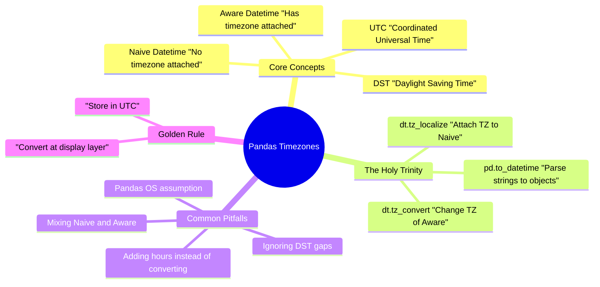
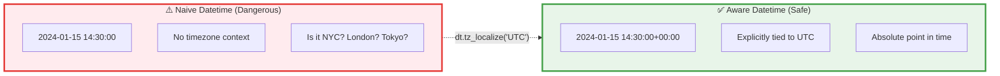
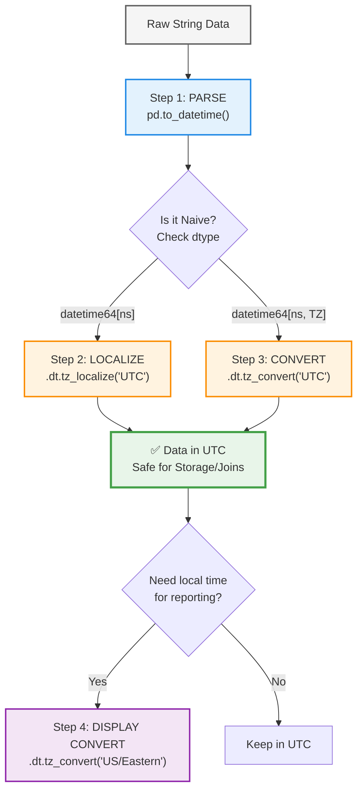
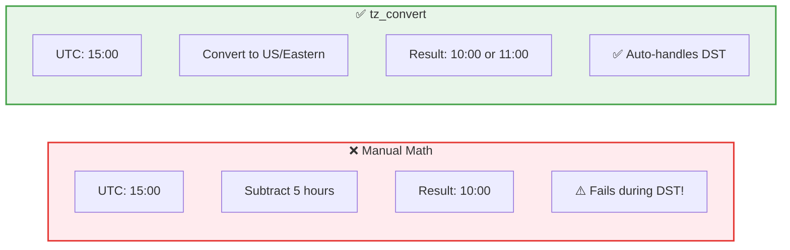
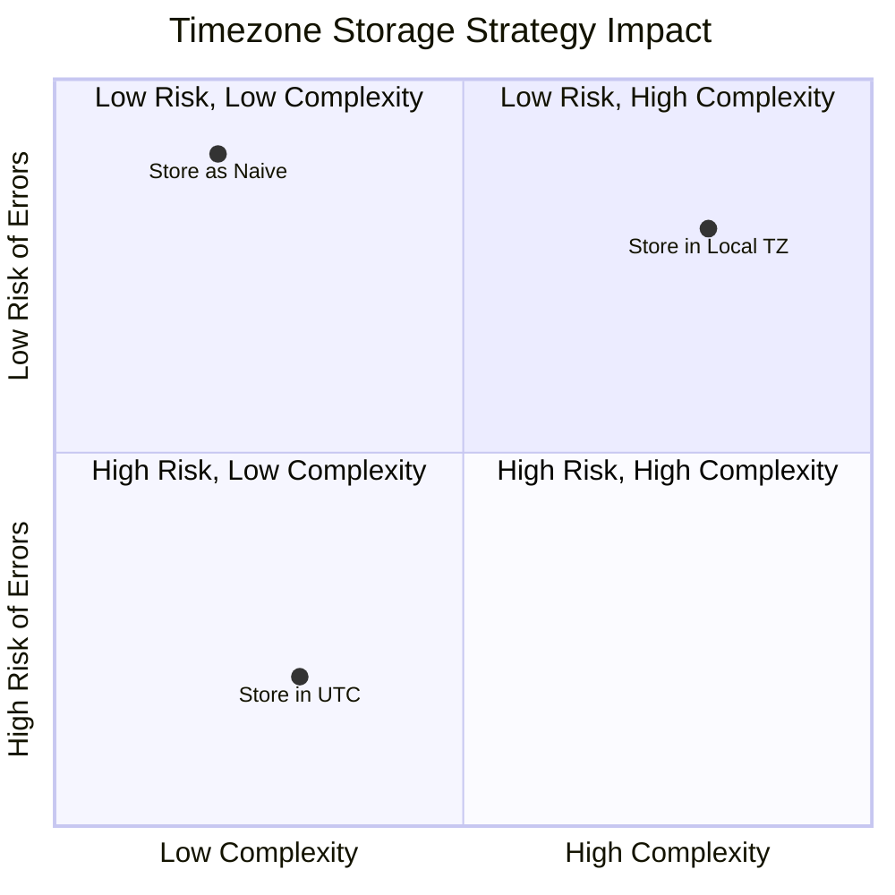
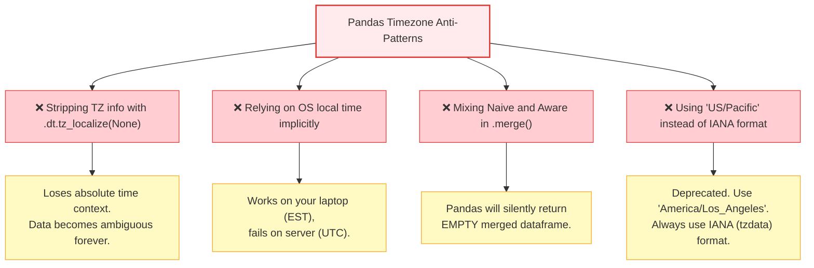
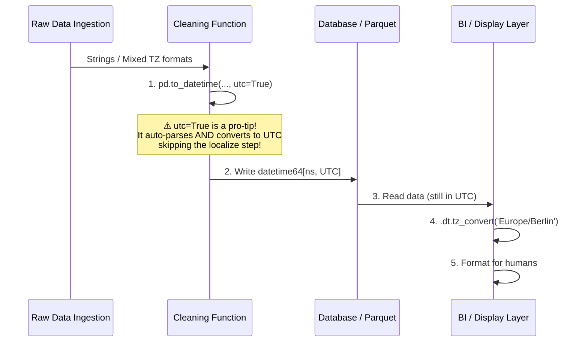

# Data Cleaning: Handling Timezones in Pandas

## Executive Summary

Timezone handling is one of the most insidious data quality issues. Unlike missing values or wrong data types, timezone errors often don't throw exceptions—they simply shift your data by a few hours, silently corrupting joins, aggregations, and financial reports. In Pandas, timezone management relies on understanding the strict difference between **Naive** and **Timezone-Aware** datetime objects, and mastering three core operations: parsing, localizing, and converting.



---

## 1. The Core Problem: Naive vs. Aware

Before writing a single line of code, you must understand the two states of time data in Pandas.



### 1.1 Identifying Naive vs. Aware in Pandas

```python
import pandas as pd

# NAIVE: Notice the lack of timezone info at the end
naive_series = pd.Series(['2024-10-25 08:00:00'])
naive_dt = pd.to_datetime(naive_series)
print(naive_dt) 
# Output: 0   2024-10-25 08:00:00
# dtype: datetime64[ns]  <-- No timezone indicated

# AWARE: Notice the '+00:00' (UTC)
aware_dt = naive_dt.dt.tz_localize('UTC')
print(aware_dt) 
# Output: 0   2024-10-25 08:00:00+00:00
# dtype: datetime64[ns, UTC]  <-- UTC explicitly stated
```

---

## 2. The Pandas Timezone Workflow (The Holy Trinity)

Never guess timezones. Follow this exact operational flow to safely handle time data.



---

## 3. Scenario 1: Handling Naive Data (Assumed UTC)

*Scenario: You receive a CSV from an API. You know the server sends timestamps in UTC, but the file doesn't explicitly state it.*

```python
df = pd.DataFrame({
    'event': ['login', 'purchase'],
    'timestamp_str': ['2024-10-25 14:30:00', '2024-10-25 15:00:00']
})

# Step 1: Parse
df['ts'] = pd.to_datetime(df['timestamp_str'])

# Step 2: Localize (Attach UTC)
df['ts_utc'] = df['ts'].dt.tz_localize('UTC')

print(df['ts_utc'])
# 0   2024-10-25 14:30:00+00:00
# 1   2024-10-25 15:00:00+00:00
# Name: ts_utc, dtype: datetime64[ns, UTC]
```

### 3.1 The Fatal Error: Localizing Already Aware Data

```python
# ❌ FATAL ERROR
try:
    df['ts_utc'].dt.tz_localize('US/Eastern')
except TypeError as e:
    print(f"Error: {e}")
    # Error: Cannot tz_localize a tz-aware datetime series
```

---

## 4. Scenario 2: Converting Between Timezones

*Scenario: You have UTC data, but your business users in New York need reports in Eastern Time.*

```python
# Step 3: Convert (NOT Localize!)
df['ts_nyc'] = df['ts_utc'].dt.tz_convert('US/Eastern')

print(df[['ts_utc', 'ts_nyc']])
#                      ts_utc                 ts_nyc
# 0 2024-10-25 14:30:00+00:00 2024-10-25 10:30:00-04:00
# 1 2024-10-25 15:00:00+00:00 2024-10-25 11:00:00-04:00
# Note: -04:00 indicates EDT (Eastern Daylight Time)
```

### 4.1 The Wrong Way: Manual Math



```python
# ❌ NEVER DO THIS
# df['ts_nyc_wrong'] = df['ts_utc'] - pd.Timedelta(hours=5)

# ✅ ALWAYS DO THIS
df['ts_nyc_right'] = df['ts_utc'].dt.tz_convert('US/Eastern')
```

---

## 5. The Golden Rule: Store in UTC

Why is storing in UTC non-negotiable?



| Operation | Stored in UTC | Stored in Local/Naive |
| :--- | :--- | :--- |
| **Joining Datasets** | Direct match | Requires conversion first, risk of mismatch |
| **Aggregating (Daily)** | Standard 00:00 to 23:59 UTC | Shifts based on timezone offset rules |
| **Handling DST** | Immune (UTC has no DST) | Nightmares (missing hours, duplicate hours) |
| **Global Users** | Easy to convert to any local TZ | Requires knowing original TZ (often lost) |

---

## 6. The Edge Case: Daylight Saving Time (DST)

DST breaks naive logic. Pandas handles it elegantly *if* you use timezone-aware objects.

```mermaid
timeline
    title US/Eastern DST Transition (Spring Forward)
    section Before DST (EST)
        01:59 AM EST : Normal Time
    section The Gap (Invalid Time)
        02:00 AM EST : ❌ Does not exist
        02:30 AM EST : ❌ Does not exist
    section After DST (EDT)
        03:00 AM EDT : Clock jumps here
        04:00 AM EDT : Normal Time
```

### 6.1 Handling the "Missing Hour" (Spring Forward)

If you try to localize a time that doesn't exist, Pandas will throw an error unless you tell it what to do.

```python
import pytz

# The missing hour: 2:30 AM on March 10, 2024 (DST start)
naive_spring = pd.to_datetime('2024-03-10 02:30:00')

# ❌ ERROR: Non-existent time
# naive_spring.tz_localize('US/Eastern') 

# ✅ SOLUTION 1: Shift forward to the next valid time (03:30 AM)
fixed_forward = naive_spring.tz_localize('US/Eastern', nonexistent='shift_forward')

# ✅ SOLUTION 2: Shift backward to the previous valid time (01:30 AM)
fixed_backward = naive_spring.tz_localize('US/Eastern', nonexistent='shift_backward')

# ✅ SOLUTION 3: Fill with a specific timezone (e.g., assume UTC then convert)
fixed_utc = naive_spring.tz_localize('UTC').dt.tz_convert('US/Eastern')
```

### 6.2 Handling the "Duplicate Hour" (Fall Back)

In the fall, 1:30 AM happens twice. Which one do you mean?

```python
# The duplicate hour: 1:30 AM on November 3, 2024 (DST end)
naive_fall = pd.to_datetime('2024-11-03 01:30:00')

# ❌ ERROR: Ambiguous time
# naive_fall.tz_localize('US/Eastern')

# ✅ SOLUTION: Explicitly state if it's the FIRST (DST) or SECOND (Standard) occurrence
fall_dst = naive_fall.tz_localize('US/Eastern', ambiguous='first')  # EDT (-04:00)
fall_std = naive_fall.tz_localize('US/Eastern', ambiguous='second') # EST (-05:00)
```

---

## 7. Common Pitfalls & Anti-Patterns



### 7.1 The Silent Merge Failure

```python
df1 = pd.DataFrame({'ts': pd.to_datetime(['2024-01-01']).tz_localize('UTC'), 'val': 1})
df2 = pd.DataFrame({'ts': pd.to_datetime(['2024-01-01']), 'val2': 2}) # Naive

# ❌ SILENT FAILURE: Returns 0 rows!
merged_wrong = pd.merge(df1, df2, on='ts') 
print(len(merged_wrong)) # 0

# ✅ FIX: Make both aware before merging
df2['ts'] = df2['ts'].dt.tz_localize('UTC')
merged_right = pd.merge(df1, df2, on='ts')
print(len(merged_right)) # 1
```

---

## 8. The Ultimate Pandas Timezone Pipeline

Implement this as a standard function in your data cleaning utils.



### 8.1 The "Cheat Code": `utc=True`

The absolute safest and cleanest way to parse datetimes in Pandas:

```python
df = pd.DataFrame({
    'ts_string': [
        '2024-10-25 14:00:00+00:00',  # Already UTC
        '2024-10-25 10:00:00-04:00',  # New York (EDT)
        '2024-10-25 15:00:00+01:00'   # Berlin (CET)
    ]
})

# ✅ THE CHEAT CODE: utc=True
# Parses mixed offsets and IMMEDIATELY converts everything to UTC
df['ts_safe'] = pd.to_datetime(df['ts_string'], utc=True)

print(df['ts_safe'])
# 0   2024-10-25 14:00:00+00:00
# 1   2024-10-25 14:00:00+00:00  <-- Correctly converted from -04:00
# 2   2024-10-25 14:00:00+00:00  <-- Correctly converted from +01:00
# Name: ts_safe, dtype: datetime64[ns, UTC]
```

---

## 9. Quick Reference Cheatsheet

### 9.1 Operations Matrix

| Operation | Pandas Method | Input State | Output State | Use Case |
| :--- | :--- | :--- | :--- | :--- |
| **Parse** | `pd.to_datetime()` | String | Naive | Reading CSVs/JSON |
| **Parse + UTC** | `pd.to_datetime(utc=True)` | String | Aware (UTC) | Safest ingestion method |
| **Localize** | `.dt.tz_localize('TZ')` | Naive | Aware | Attaching TZ to naive data |
| **Convert** | `.dt.tz_convert('TZ')` | Aware | Aware | Changing from TZ1 to TZ2 |
| **Remove TZ** | `.dt.tz_localize(None)` | Aware | Naive | ⚠️ Rarely recommended |
| **Get Offset** | `.dt.utcoffset()` | Aware | Timedelta | Checking hour differences |

### 9.2 Common IANA Timezone Formats

> **Rule:** Always use the `Region/City` format. Never use 3-letter abbreviations (EST, PST) as they are ambiguous and deprecated in modern systems.

```python
# ✅ CORRECT (IANA / tzdata format)
'timezone' : 'America/New_York'
'timezone' : 'America/Los_Angeles'
'timezone' : 'Europe/London'
'timezone' : 'Asia/Tokyo'
'timezone' : 'UTC'

# ❌ WRONG (Ambiguous)
'timezone' : 'EST'  # Is it EDT in summer? 
'timezone' : 'CST'  # Chicago? China? Cuba?
```

### 9.3 Visual Decision Tree

```mermaid
flowchart TD
    Start([Incoming Time Column]) --> Q1{Is it a String?}
    Q1 -->|Yes| Action1["pd.to_datetime(col, utc=True)"]
    Q1 -->|No| Q2{Is it Naive? dtype: datetime64[ns]}
    
    Q2 -->|Yes| Q3{"Do you KNOW the source TZ?"}
    Q3 -->|Yes| Action2["col.dt.tz_localize('Known/TZ')"]
    Q3 -->|No| Action3["⚠️ STOP. Ask the data owner."]
    
    Q2 -->|No - It is Aware| Q4{"Is it already in UTC?<br/>dtype: datetime64[ns, UTC]"}
    Q4 -->|Yes| Done(["✅ Done. Ready for storage/joins."])
    Q4 -->|No| Action4["col.dt.tz_convert('UTC')"]
    
    Action1 --> Done
    Action2 --> Done
    Action4 --> Done

    style Start fill:#e3f2fd,stroke:#1e88e5,stroke-width:2px
    style Done fill:#e8f5e9,stroke:#43a047,stroke-width:3px
    style Action3 fill:#ffebee,stroke:#e53935,stroke-width:3px
    style Action1 fill:#fff3e0,stroke:#fb8c00,stroke-width:2px
    style Action2 fill:#fff3e0,stroke:#fb8c00,stroke-width:2px
    style Action4 fill:#fff3e0,stroke:#fb8c00,stroke-width:2px
```
