# Data Engineering Grain Mismatch Handling

---

## 0. Prerequisite Tutorial: What Is Grain?

> If you don't understand grain, you cannot fix grain mismatch. Read this first.

### 0.1 Grain Definition

**Grain** is the single most important concept in dimensional modeling. It is the answer to one question:

> **What does exactly ONE row in this fact table represent?**

That's it. Nothing more, nothing less.

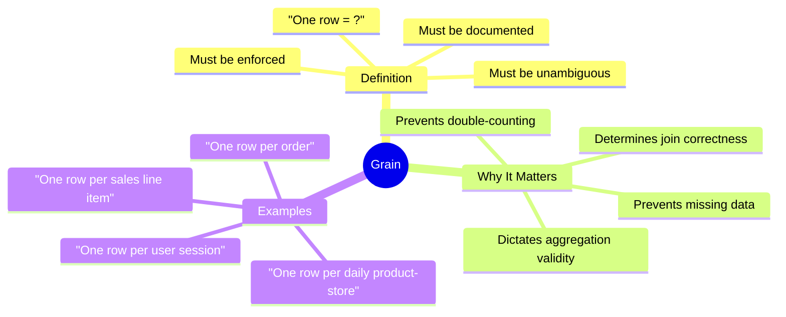
```mermaid
mindmap
  root((Grain))
    Definition
      "One row = ?"
      Must be unambiguous
      Must be documented
      Must be enforced
    Why It Matters
      Determines join correctness
      Prevents double-counting
      Prevents missing data
      Dictates aggregation validity
    Examples
      "One row per sales line item"
      "One row per daily product-store"
      "One row per user session"
      "One row per order"
```

### 0.2 Grain Examples in Plain English

| Fact Table | Grain Statement | Row Meaning |
|------------|-----------------|-------------|
| `FactSales` | One row per sales order line item | Each row = one product in one order |
| `FactDailyInventory` | One row per product per store per day | Each row = stock level snapshot |
| `FactPageViews` | One row per page view event | Each row = one user viewing one page |
| `FactMonthlyRevenue` | One row per customer per month | Each row = aggregated monthly spend |

### 0.3 How to Determine Grain

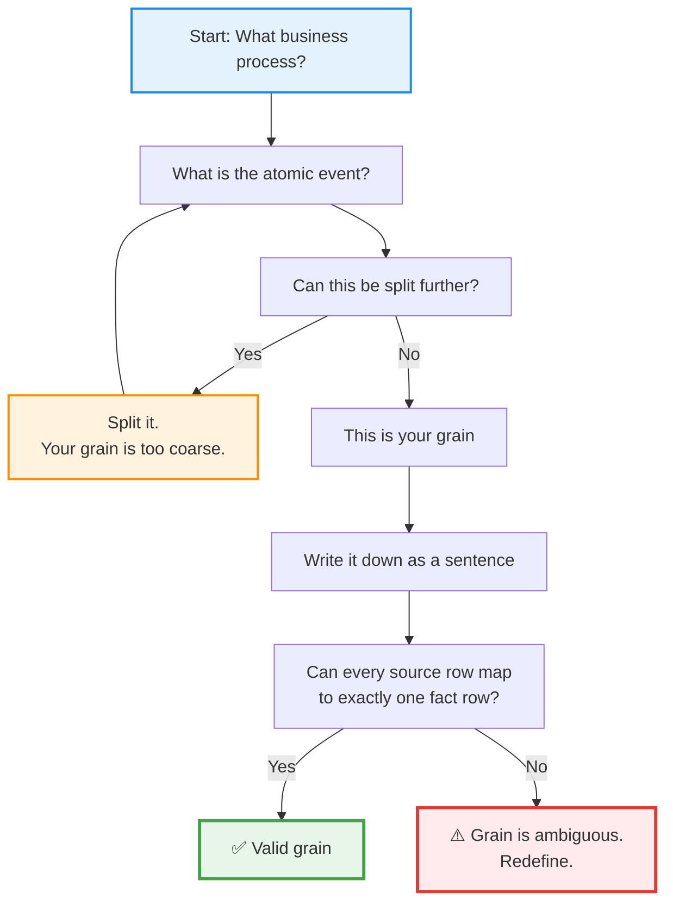
```mermaid
flowchart TD
    A[Start: What business process?] --> B[What is the atomic event?]
    B --> C[Can this be split further?]
    C -->|Yes| D["Split it.<br/>Your grain is too coarse."]
    C -->|No| E[This is your grain]
    E --> F[Write it down as a sentence]
    F --> G[Can every source row map<br/>to exactly one fact row?]
    G -->|Yes| H[✅ Valid grain]
    G -->|No| I["⚠️ Grain is ambiguous.<br/>Redefine."]
    D --> B

    style A fill:#e3f2fd,stroke:#1e88e5,stroke-width:2px
    style H fill:#e8f5e9,stroke:#43a047,stroke-width:3px
    style I fill:#ffebee,stroke:#e53935,stroke-width:3px
    style D fill:#fff3e0,stroke:#fb8c00,stroke-width:2px
```

### 0.4 Grain Is Not Granularity (Critical Distinction)

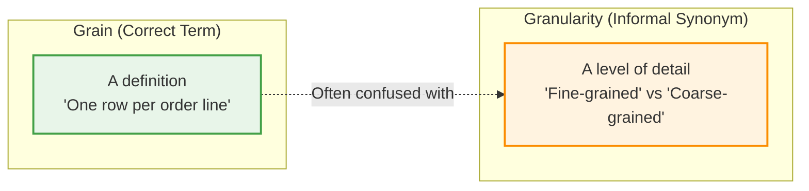
```mermaid
graph LR
    subgraph "Grain (Correct Term)"
        G1["A definition<br/>'One row per order line'"]
    end
    subgraph "Granularity (Informal Synonym)"
        G2["A level of detail<br/>'Fine-grained' vs 'Coarse-grained'"]
    end
    G1 -.->|"Often confused with"| G2

    style G1 fill:#e8f5e9,stroke:#43a047,stroke-width:2px
    style G2 fill:#fff3e0,stroke:#fb8c00,stroke-width:2px
```

> **Rule:** Always use the word "grain" with a precise sentence definition. Never say "the grain is fine." Say "the grain is one row per order line item."

### 0.5 Grain Lock Principle

Once you define the grain of a fact table, it is **locked**. Every row must conform. Every ETL process must respect it. Every downstream consumer must understand it.

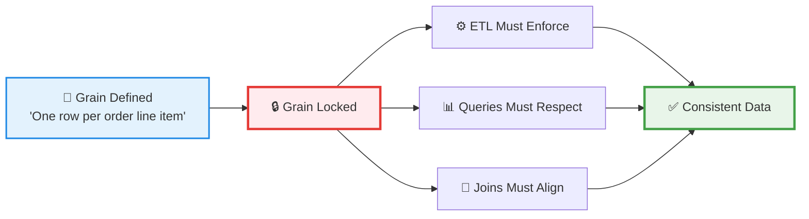
```mermaid
flowchart LR
    A["📝 Grain Defined<br/>'One row per order line item'"] --> B["🔒 Grain Locked"]
    B --> C["⚙️ ETL Must Enforce"]
    B --> D["📊 Queries Must Respect"]
    B --> E["🔗 Joins Must Align"]
    C --> F["✅ Consistent Data"]
    D --> F
    E --> F

    style A fill:#e3f2fd,stroke:#1e88e5,stroke-width:2px
    style B fill:#ffebee,stroke:#e53935,stroke-width:3px
    style F fill:#e8f5e9,stroke:#43a047,stroke-width:3px
```

---

## 1. Executive Summary

**Grain mismatch** occurs when two or more data sources, tables, or queries operate at different levels of detail and are combined without proper alignment. It is one of the most dangerous and silent data engineering errors because it produces **wrong numbers that look right**.

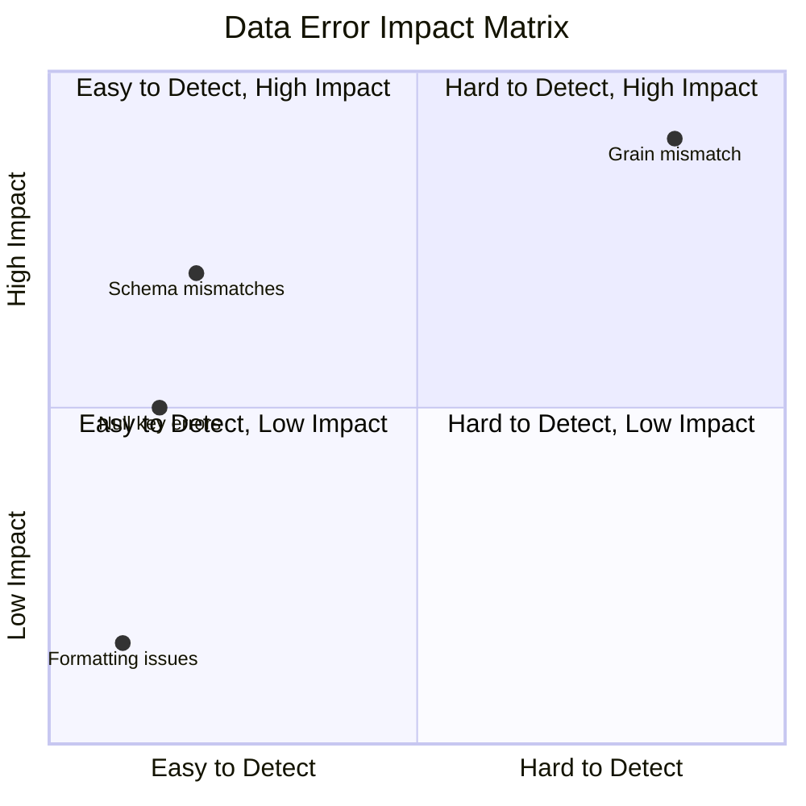
```mermaid
quadrantChart
    title Data Error Impact Matrix
    x-axis Easy to Detect --> Hard to Detect
    y-axis Low Impact --> High Impact
    quadrant-1 "Hard to Detect, High Impact"
    quadrant-2 "Easy to Detect, High Impact"
    quadrant-3 "Easy to Detect, Low Impact"
    quadrant-4 "Hard to Detect, Low Impact"
    "Schema mismatches": [0.2, 0.7]
    "Null key errors": [0.15, 0.5]
    "Grain mismatch": [0.85, 0.9]
    "Formatting issues": [0.1, 0.15]
```

---

## 2. What Is Grain Mismatch?

### 2.1 Definition

**Grain mismatch** is the condition where data from two or more sources that represent different levels of detail are incorrectly combined, resulting in duplicated, fragmented, or inaccurate data.

### 2.2 The Core Problem Visualized

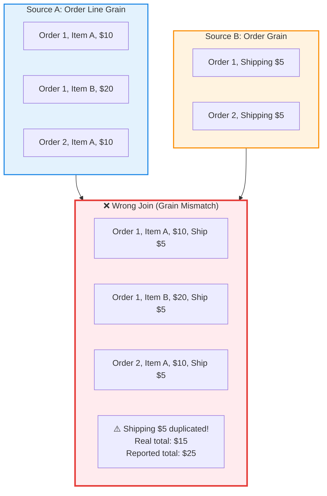
```mermaid
flowchart TD
    subgraph SourceA["Source A: Order Line Grain"]
        A1["Order 1, Item A, $10"]
        A2["Order 1, Item B, $20"]
        A3["Order 2, Item A, $10"]
    end

    subgraph SourceB["Source B: Order Grain"]
        B1["Order 1, Shipping $5"]
        B2["Order 2, Shipping $5"]
    end

    subgraph Wrong["❌ Wrong Join (Grain Mismatch)"]
        W1["Order 1, Item A, $10, Ship $5"]
        W2["Order 1, Item B, $20, Ship $5"]
        W3["Order 2, Item A, $10, Ship $5"]
        W4["⚠️ Shipping $5 duplicated!<br/>Real total: $15<br/>Reported total: $25"]
    end

    SourceA --> Wrong
    SourceB --> Wrong

    style Wrong fill:#ffebee,stroke:#e53935,stroke-width:3px
    style SourceA fill:#e3f2fd,stroke:#1e88e5,stroke-width:2px
    style SourceB fill:#fff3e0,stroke:#fb8c00,stroke-width:2px
```

### 2.3 Types of Grain Mismatch

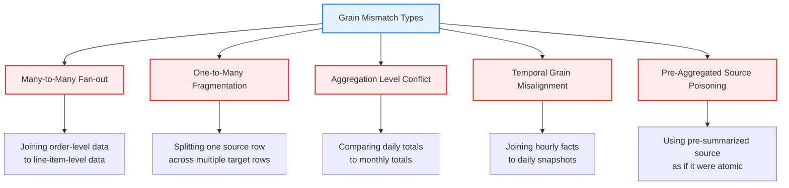
```mermaid
flowchart TD
    A[Grain Mismatch Types] --> B[Many-to-Many Fan-out]
    A --> C[One-to-Many Fragmentation]
    A --> D[Aggregation Level Conflict]
    A --> E[Temporal Grain Misalignment]
    A --> F[Pre-Aggregated Source Poisoning]

    B --> B1["Joining order-level data<br/>to line-item-level data"]
    C --> C1["Splitting one source row<br/>across multiple target rows"]
    D --> D1["Comparing daily totals<br/>to monthly totals"]
    E --> E1["Joining hourly facts<br/>to daily snapshots"]
    F --> F1["Using pre-summarized source<br/>as if it were atomic"]

    style A fill:#e3f2fd,stroke:#1e88e5,stroke-width:2px
    style B fill:#ffebee,stroke:#e53935,stroke-width:2px
    style C fill:#ffebee,stroke:#e53935,stroke-width:2px
    style D fill:#ffebee,stroke:#e53935,stroke-width:2px
    style E fill:#ffebee,stroke:#e53935,stroke-width:2px
    style F fill:#ffebee,stroke:#e53935,stroke-width:2px
```

---

## 3. Anatomy of a Grain Mismatch (Detailed Walkthrough)

### 3.1 Scenario: E-Commerce Data Pipeline

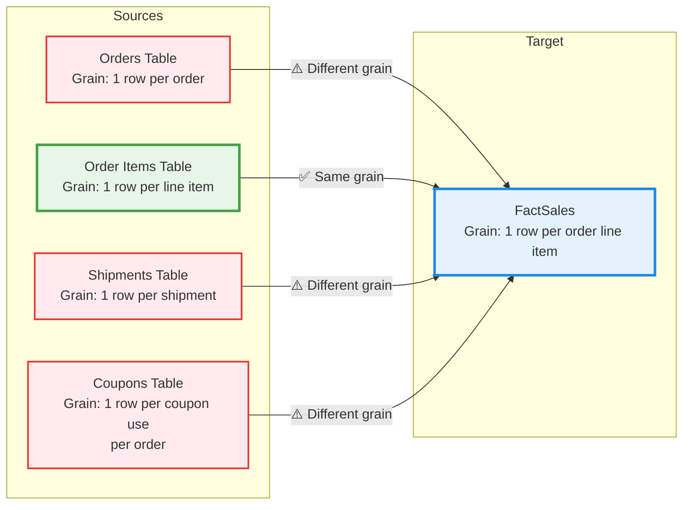
```mermaid
flowchart LR
    subgraph Sources
        O[Orders Table<br/>Grain: 1 row per order]
        I[Order Items Table<br/>Grain: 1 row per line item]
        S[Shipments Table<br/>Grain: 1 row per shipment]
        C[Coupons Table<br/>Grain: 1 row per coupon use<br/>per order]
    end

    subgraph Target
        F[FactSales<br/>Grain: 1 row per order line item]
    end

    O -->|"⚠️ Different grain"| F
    I -->|"✅ Same grain"| F
    S -->|"⚠️ Different grain"| F
    C -->|"⚠️ Different grain"| F

    style O fill:#ffebee,stroke:#e53935,stroke-width:2px
    style I fill:#e8f5e9,stroke:#43a047,stroke-width:3px
    style S fill:#ffebee,stroke:#e53935,stroke-width:2px
    style C fill:#ffebee,stroke:#e53935,stroke-width:2px
    style F fill:#e3f2fd,stroke:#1e88e5,stroke-width:3px
```

### 3.2 The Data

**Orders Table** (Grain: 1 row per order)
| OrderID | OrderDate | CustomerID | ShippingCost |
|---------|-----------|------------|--------------|
| 1001 | 2024-01-15 | C001 | $5.00 |
| 1002 | 2024-01-15 | C002 | $3.00 |

**Order Items Table** (Grain: 1 row per line item)
| OrderID | LineNum | ProductID | Quantity | UnitPrice |
|---------|---------|-----------|----------|-----------|
| 1001 | 1 | P001 | 2 | $10.00 |
| 1001 | 2 | P002 | 1 | $25.00 |
| 1002 | 1 | P003 | 3 | $8.00 |

**Coupons Table** (Grain: 1 row per coupon per order)
| OrderID | CouponCode | DiscountAmount |
|---------|------------|----------------|
| 1001 | SAVE10 | $10.00 |
| 1002 | SAVE5 | $5.00 |

### 3.3 The Wrong Way (Fan-out Trap)

```sql
-- ❌ GRAIN MISMATCH: Orders has 1 row, Items has 2 rows for Order 1001
-- Shipping cost gets duplicated!
SELECT 
    i.OrderID,
    i.LineNum,
    i.ProductID,
    i.Quantity * i.UnitPrice AS LineTotal,
    o.ShippingCost,           -- ⚠️ DUPLICATED for each line item
    c.DiscountAmount          -- ⚠️ DUPLICATED for each line item
FROM OrderItems i
JOIN Orders o ON i.OrderID = o.OrderID
JOIN Coupons c ON i.OrderID = c.OrderID;
```

**Wrong Result:**
| OrderID | LineNum | LineTotal | ShippingCost | DiscountAmount |
|---------|---------|-----------|--------------|----------------|
| 1001 | 1 | $20.00 | $5.00 | $10.00 |
| 1001 | 2 | $25.00 | $5.00 | $10.00 |
| 1002 | 1 | $24.00 | $3.00 | $5.00 |

> **If you SUM ShippingCost: $5 + $5 + $3 = $13.00**
> **Actual ShippingCost: $5 + $3 = $8.00**
> **Inflation: 62.5% — completely wrong.**

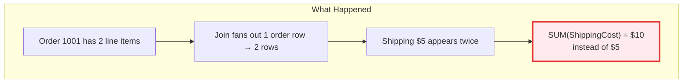
```mermaid
graph TD
    subgraph "What Happened"
        A["Order 1001 has 2 line items"] --> B["Join fans out 1 order row → 2 rows"]
        B --> C["Shipping $5 appears twice"]
        C --> D["SUM(ShippingCost) = $10<br/>instead of $5"]
    end

    style D fill:#ffebee,stroke:#e53935,stroke-width:3px
```

### 3.4 The Right Way (Three Strategies)

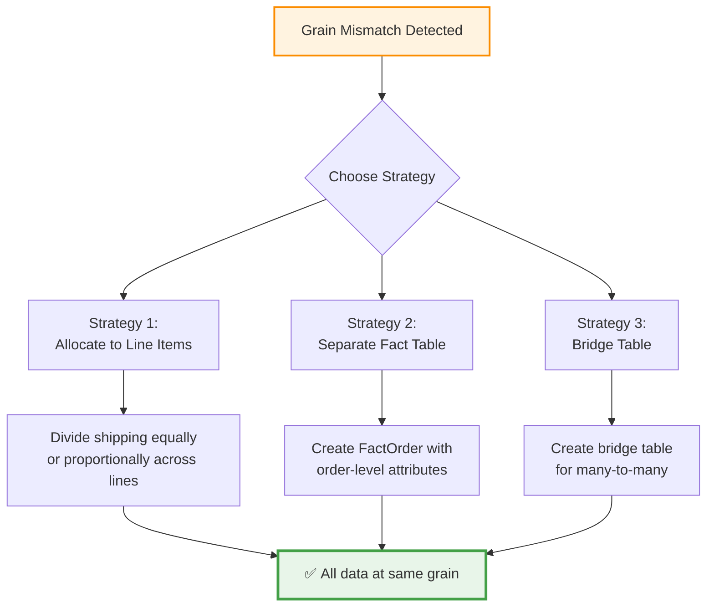
```mermaid
flowchart TD
    A["Grain Mismatch Detected"] --> B{Choose Strategy}
    B --> C["Strategy 1:<br/>Allocate to Line Items"]
    B --> D["Strategy 2:<br/>Separate Fact Table"]
    B --> E["Strategy 3:<br/>Bridge Table"]

    C --> C1["Divide shipping equally<br/>or proportionally across lines"]
    D --> D1["Create FactOrder with<br/>order-level attributes"]
    E --> E1["Create bridge table<br/>for many-to-many"]

    C1 --> F["✅ All data at same grain"]
    D1 --> F
    E1 --> F

    style A fill:#fff3e0,stroke:#fb8c00,stroke-width:2px
    style F fill:#e8f5e9,stroke:#43a047,stroke-width:3px
```

---

## 4. Strategy 1: Allocation (Proportional Distribution)

### 4.1 Concept

Distribute the higher-grain value across lower-grain rows proportionally.

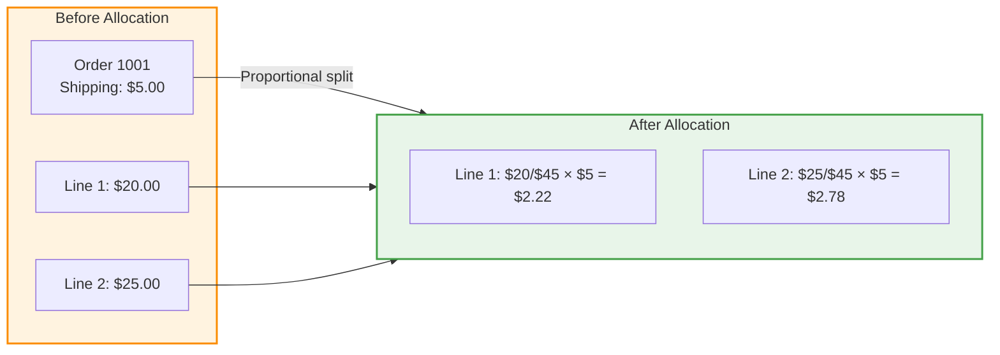
```mermaid
flowchart LR
    subgraph Before["Before Allocation"]
        O1["Order 1001<br/>Shipping: $5.00"]
        I1["Line 1: $20.00"]
        I2["Line 2: $25.00"]
    end

    subgraph After["After Allocation"]
        A1["Line 1: $20/$45 × $5 = $2.22"]
        A2["Line 2: $25/$45 × $5 = $2.78"]
    end

    O1 -->|"Proportional split"| After
    I1 --> After
    I2 --> After

    style Before fill:#fff3e0,stroke:#fb8c00,stroke-width:2px
    style After fill:#e8f5e9,stroke:#43a047,stroke-width:2px
```

### 4.2 SQL Implementation

```sql
-- ✅ STRATEGY 1: Proportional allocation
WITH OrderTotals AS (
    SELECT 
        OrderID, 
        SUM(Quantity * UnitPrice) AS OrderLineTotal,
        SUM(Quantity * UnitPrice) OVER (PARTITION BY OrderID) AS OrderTotal
    FROM OrderItems
    GROUP BY OrderID
)
SELECT 
    i.OrderID,
    i.LineNum,
    i.ProductID,
    i.Quantity * i.UnitPrice AS LineTotal,
    -- Proportionally allocate shipping
    ROUND(
        (i.Quantity * i.UnitPrice) / ot.OrderTotal * o.ShippingCost, 
        2
    ) AS AllocatedShipping,
    -- Proportionally allocate discount
    ROUND(
        (i.Quantity * i.UnitPrice) / ot.OrderTotal * c.DiscountAmount, 
        2
    ) AS AllocatedDiscount
FROM OrderItems i
JOIN Orders o ON i.OrderID = o.OrderID
JOIN Coupons c ON i.OrderID = c.OrderID
JOIN OrderTotals ot ON i.OrderID = ot.OrderID;
```

### 4.3 Allocation Methods

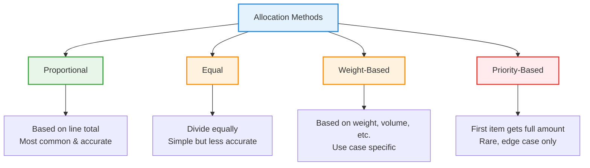
```mermaid
flowchart TD
    A[Allocation Methods] --> B[Proportional]
    A --> C[Equal]
    A --> D[Weight-Based]
    A --> E[Priority-Based]

    B --> B1["Based on line total<br/>Most common & accurate"]
    C --> C1["Divide equally<br/>Simple but less accurate"]
    D --> D1["Based on weight, volume, etc.<br/>Use case specific"]
    E --> E1["First item gets full amount<br/>Rare, edge case only"]

    style A fill:#e3f2fd,stroke:#1e88e5,stroke-width:2px
    style B fill:#e8f5e9,stroke:#43a047,stroke-width:2px
    style C fill:#fff3e0,stroke:#fb8c00,stroke-width:2px
    style D fill:#fff3e0,stroke:#fb8c00,stroke-width:2px
    style E fill:#ffebee,stroke:#e53935,stroke-width:2px
```

### 4.4 Handling Rounding Errors

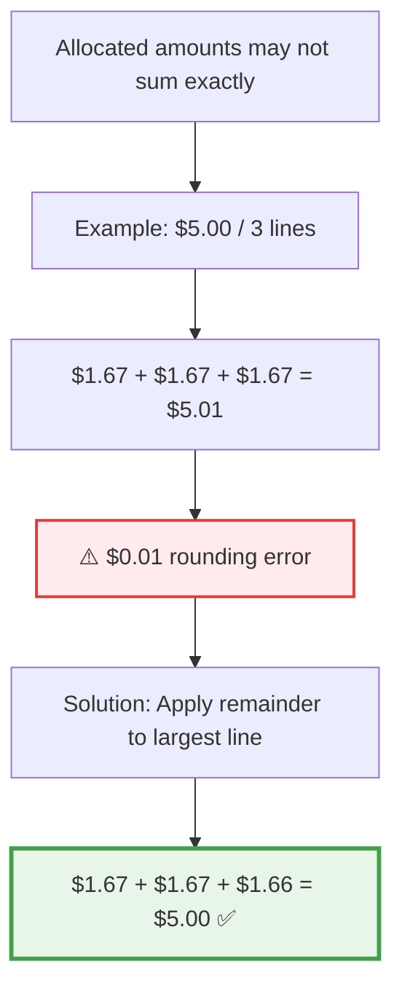
```mermaid
flowchart TD
    A["Allocated amounts may not sum exactly"] --> B["Example: $5.00 / 3 lines"]
    B --> C["$1.67 + $1.67 + $1.67 = $5.01"]
    C --> D["⚠️ $0.01 rounding error"]
    D --> E["Solution: Apply remainder to largest line"]
    E --> F["$1.67 + $1.67 + $1.66 = $5.00 ✅"]

    style D fill:#ffebee,stroke:#e53935,stroke-width:2px
    style F fill:#e8f5e9,stroke:#43a047,stroke-width:3px
```

```sql
-- ✅ Handle rounding: allocate remainder to largest line item
WITH Allocation AS (
    SELECT 
        i.OrderID,
        i.LineNum,
        i.Quantity * i.UnitPrice AS LineTotal,
        ot.OrderTotal,
        o.ShippingCost,
        ROUND((i.Quantity * i.UnitPrice) / ot.OrderTotal * o.ShippingCost, 2) AS AllocatedShipping,
        ROW_NUMBER() OVER (PARTITION BY i.OrderID ORDER BY i.Quantity * i.UnitPrice DESC) AS Rn
    FROM OrderItems i
    JOIN Orders o ON i.OrderID = o.OrderID
    JOIN OrderTotals ot ON i.OrderID = ot.OrderID
),
Remainder AS (
    SELECT 
        OrderID, 
        ShippingCost - SUM(AllocatedShipping) AS RemainderAmt
    FROM Allocation
    GROUP BY OrderID, ShippingCost
)
SELECT 
    a.OrderID,
    a.LineNum,
    a.LineTotal,
    CASE 
        WHEN a.Rn = 1 THEN a.AllocatedShipping + r.RemainderAmt
        ELSE a.AllocatedShipping 
    END AS FinalAllocatedShipping
FROM Allocation a
JOIN Remainder r ON a.OrderID = r.OrderID;
```

### 4.5 Pros and Cons of Allocation

| Aspect | Assessment |
|--------|------------|
| **Accuracy** | Approximate, not exact |
| **Complexity** | Moderate (rounding handling needed) |
| **Query Simplicity** | High (single fact table) |
| **Auditability** | Difficult (allocated values are synthetic) |
| **Best For** | When allocation is business-accepted practice |

---

## 5. Strategy 2: Separate Fact Tables (Grain Segregation)

### 5.1 Concept

Instead of forcing everything into one grain, create multiple fact tables at their natural grains.

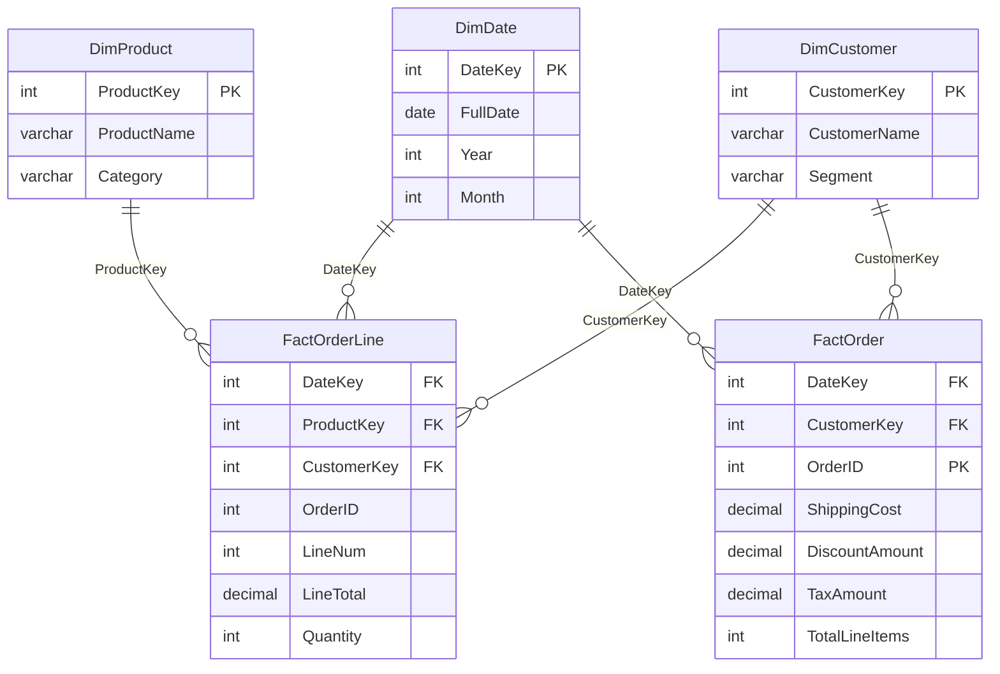
```mermaid
erDiagram
    DimDate ||--o{ FactOrderLine : DateKey
    DimDate ||--o{ FactOrder : DateKey
    DimProduct ||--o{ FactOrderLine : ProductKey
    DimCustomer ||--o{ FactOrderLine : CustomerKey
    DimCustomer ||--o{ FactOrder : CustomerKey

    FactOrderLine {
        int DateKey FK
        int ProductKey FK
        int CustomerKey FK
        int OrderID
        int LineNum
        decimal LineTotal
        int Quantity
    }

    FactOrder {
        int DateKey FK
        int CustomerKey FK
        int OrderID PK
        decimal ShippingCost
        decimal DiscountAmount
        decimal TaxAmount
        int TotalLineItems
    }

    DimDate {
        int DateKey PK
        date FullDate
        int Year
        int Month
    }

    DimProduct {
        int ProductKey PK
        varchar ProductName
        varchar Category
    }

    DimCustomer {
        int CustomerKey PK
        varchar CustomerName
        varchar Segment
    }
```

### 5.2 Visual Architecture

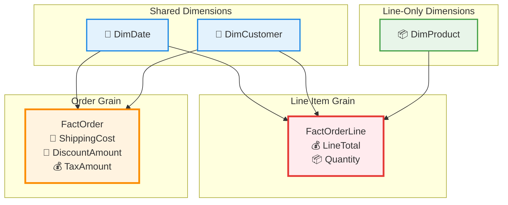
```mermaid
graph TD
    subgraph "Line Item Grain"
        FL["FactOrderLine<br/>💰 LineTotal<br/>📦 Quantity"]
    end

    subgraph "Order Grain"
        FO["FactOrder<br/>🚚 ShippingCost<br/>🎫 DiscountAmount<br/>💰 TaxAmount"]
    end

    subgraph Shared Dimensions
        DD["📅 DimDate"]
        DC["👤 DimCustomer"]
    end

    subgraph Line-Only Dimensions
        DP["📦 DimProduct"]
    end

    DD --> FL
    DD --> FO
    DC --> FL
    DC --> FO
    DP --> FL

    style FL fill:#ffebee,stroke:#e53935,stroke-width:3px
    style FO fill:#fff3e0,stroke:#fb8c00,stroke-width:3px
    style DD fill:#e3f2fd,stroke:#1e88e5,stroke-width:2px
    style DC fill:#e3f2fd,stroke:#1e88e5,stroke-width:2px
    style DP fill:#e8f5e9,stroke:#43a047,stroke-width:2px
```

### 5.3 SQL Implementation

```sql
-- FactOrderLine: Grain = One row per order line item
INSERT INTO FactOrderLine (DateKey, ProductKey, CustomerKey, OrderID, LineNum, LineTotal, Quantity)
SELECT 
    d.DateKey,
    p.ProductKey,
    c.CustomerKey,
    i.OrderID,
    i.LineNum,
    i.Quantity * i.UnitPrice,
    i.Quantity
FROM OrderItems i
JOIN DimDate d ON i.OrderDate = d.FullDate
JOIN DimProduct p ON i.ProductID = p.ProductID
JOIN DimCustomer c ON i.CustomerID = c.CustomerID;

-- FactOrder: Grain = One row per order
INSERT INTO FactOrder (DateKey, CustomerKey, OrderID, ShippingCost, DiscountAmount, TaxAmount, TotalLineItems)
SELECT 
    d.DateKey,
    c.CustomerKey,
    o.OrderID,
    o.ShippingCost,
    COALESCE(coupon.DiscountAmount, 0),
    o.TaxAmount,
    (SELECT COUNT(*) FROM OrderItems oi WHERE oi.OrderID = o.OrderID)
FROM Orders o
JOIN DimDate d ON o.OrderDate = d.FullDate
JOIN DimCustomer c ON o.CustomerID = c.CustomerID
LEFT JOIN Coupons coupon ON o.OrderID = coupon.OrderID;
```

### 5.4 Querying Separate Facts

```sql
-- ✅ Query both facts for a complete picture
-- Each aggregates at its own grain, then combined
SELECT 
    d.Year,
    d.Month,
    SUM(ol.LineTotal) AS ProductRevenue,
    SUM(o.ShippingCost) AS TotalShipping,
    SUM(o.DiscountAmount) AS TotalDiscounts,
    SUM(ol.LineTotal) - SUM(o.DiscountAmount) + SUM(o.ShippingCost) AS NetRevenue
FROM FactOrderLine ol
JOIN FactOrder o ON ol.OrderID = o.OrderID
JOIN DimDate d ON ol.DateKey = d.DateKey
GROUP BY d.Year, d.Month;
```

### 5.5 Pros and Cons of Separate Facts

| Aspect | Assessment |
|--------|------------|
| **Accuracy** | Exact, no approximation |
| **Complexity** | Higher (multiple tables to maintain) |
| **Query Simplicity** | Lower (need to join/union facts) |
| **Auditability** | Excellent (each value traceable to source) |
| **Best For** | When accuracy is non-negotiable |

---

## 6. Strategy 3: Bridge Tables

### 6.1 Concept

Use a bridge table to handle many-to-many relationships between facts and dimensions at different grains.

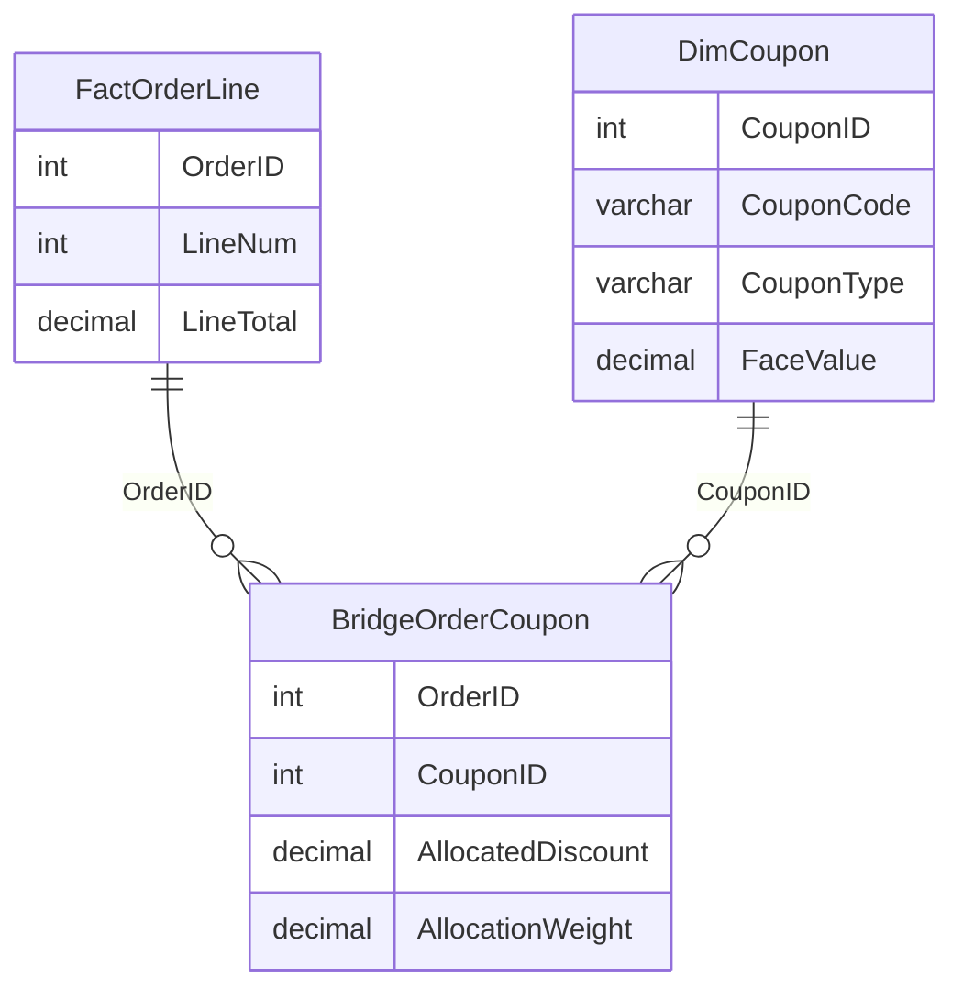
```mermaid
erDiagram
    FactOrderLine ||--o{ BridgeOrderCoupon : OrderID
    DimCoupon ||--o{ BridgeOrderCoupon : CouponID

    FactOrderLine {
        int OrderID
        int LineNum
        decimal LineTotal
    }

    BridgeOrderCoupon {
        int OrderID
        int CouponID
        decimal AllocatedDiscount
        decimal AllocationWeight
    }

    DimCoupon {
        int CouponID
        varchar CouponCode
        varchar CouponType
        decimal FaceValue
    }
```

### 6.2 When to Use Bridge Tables

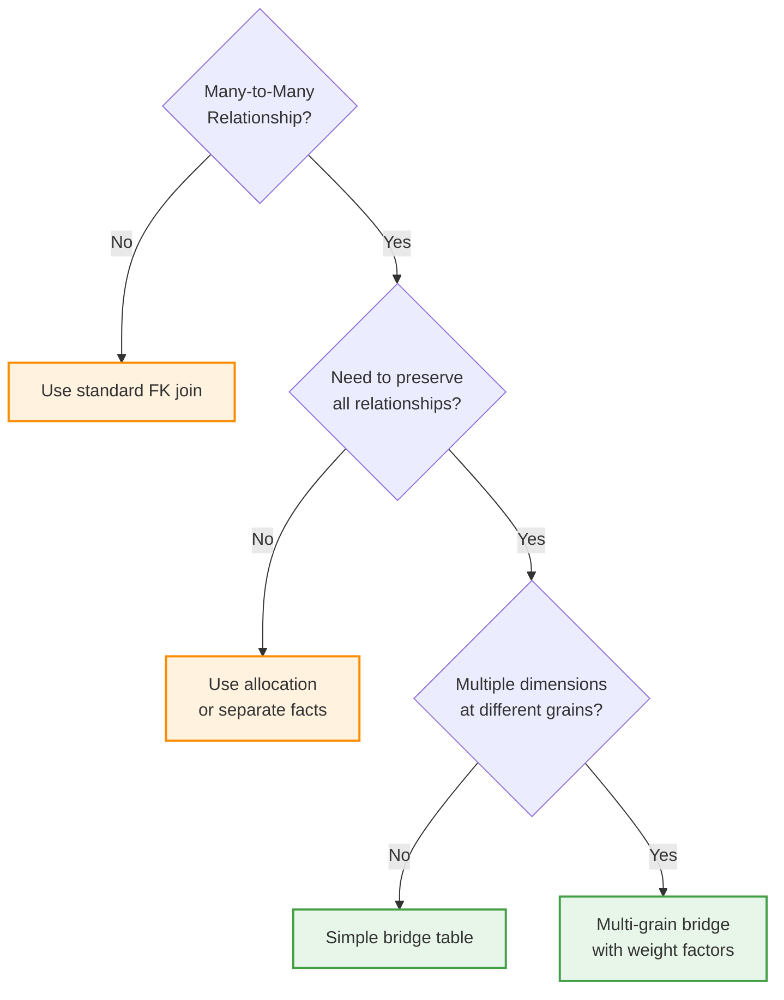
```mermaid
flowchart TD
    A{Many-to-Many<br/>Relationship?} -->|No| B["Use standard FK join"]
    A -->|Yes| C{Need to preserve<br/>all relationships?}
    C -->|No| D["Use allocation<br/>or separate facts"]
    C -->|Yes| E{Multiple dimensions<br/>at different grains?}
    E -->|No| F["Simple bridge table"]
    E -->|Yes| G["Multi-grain bridge<br/>with weight factors"]

    style F fill:#e8f5e9,stroke:#43a047,stroke-width:2px
    style G fill:#e8f5e9,stroke:#43a047,stroke-width:2px
    style B fill:#fff3e0,stroke:#fb8c00,stroke-width:2px
    style D fill:#fff3e0,stroke:#fb8c00,stroke-width:2px
```

### 6.3 SQL Implementation

```sql
-- Bridge table with allocation weights
CREATE TABLE BridgeOrderCoupon (
    OrderID INT NOT NULL,
    CouponID INT NOT NULL,
    AllocatedDiscount DECIMAL(18,2) NOT NULL,
    AllocationWeight DECIMAL(5,4) NOT NULL,
    PRIMARY KEY (OrderID, CouponID)
);

-- Populate bridge
INSERT INTO BridgeOrderCoupon (OrderID, CouponID, AllocatedDiscount, AllocationWeight)
SELECT 
    o.OrderID,
    c.CouponID,
    c.DiscountAmount,
    1.0  -- Simple case: one coupon per order
FROM Orders o
JOIN Coupons c ON o.OrderID = c.OrderID;

-- Query through bridge
SELECT 
    ol.OrderID,
    ol.LineNum,
    ol.LineTotal,
    bc.AllocatedDiscount,
    ol.LineTotal - bc.AllocatedDiscount AS NetLineTotal
FROM FactOrderLine ol
JOIN BridgeOrderCoupon bc ON ol.OrderID = bc.OrderID;
```

---

## 7. Temporal Grain Mismatch

### 7.1 The Problem

Grain mismatches often occur across time dimensions — joining hourly data to daily data, or daily to monthly.

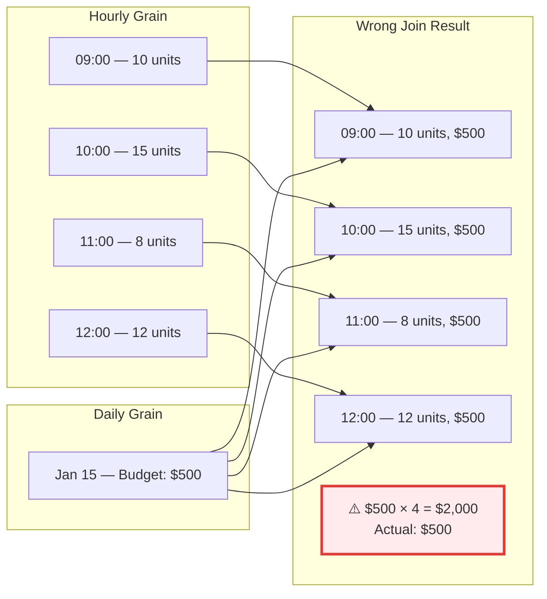
```mermaid
graph LR
    subgraph "Hourly Grain"
        H1["09:00 — 10 units"]
        H2["10:00 — 15 units"]
        H3["11:00 — 8 units"]
        H4["12:00 — 12 units"]
    end

    subgraph "Daily Grain"
        D1["Jan 15 — Budget: $500"]
    end

    subgraph "Wrong Join Result"
        W1["09:00 — 10 units, $500"]
        W2["10:00 — 15 units, $500"]
        W3["11:00 — 8 units, $500"]
        W4["12:00 — 12 units, $500"]
        W5["⚠️ $500 × 4 = $2,000<br/>Actual: $500"]
    end

    H1 --> W1
    H2 --> W2
    H3 --> W3
    H4 --> W4
    D1 --> W1
    D1 --> W2
    D1 --> W3
    D1 --> W4

    style W5 fill:#ffebee,stroke:#e53935,stroke-width:3px
```

### 7.2 Handling Strategies

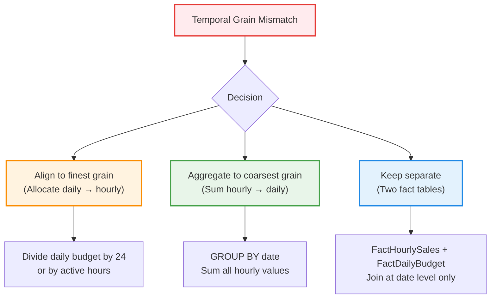
```mermaid
flowchart TD
    A["Temporal Grain Mismatch"] --> B{Decision}
    B --> C["Align to finest grain<br/>(Allocate daily → hourly)"]
    B --> D["Aggregate to coarsest grain<br/>(Sum hourly → daily)"]
    B --> E["Keep separate<br/>(Two fact tables)"]

    C --> C1["Divide daily budget by 24<br/>or by active hours"]
    D --> D1["GROUP BY date<br/>Sum all hourly values"]
    E --> E1["FactHourlySales + FactDailyBudget<br/>Join at date level only"]

    style A fill:#ffebee,stroke:#e53935,stroke-width:2px
    style C fill:#fff3e0,stroke:#fb8c00,stroke-width:2px
    style D fill:#e8f5e9,stroke:#43a047,stroke-width:2px
    style E fill:#e3f2fd,stroke:#1e88e5,stroke-width:2px
```

### 7.3 SQL: Safe Temporal Join

```sql
-- ✅ Aggregate hourly to daily BEFORE joining to daily budget
WITH DailySales AS (
    SELECT 
        DATE_TRUNC('day', EventTimestamp) AS SaleDate,
        SUM(Quantity) AS TotalQuantity,
        SUM(Revenue) AS TotalRevenue
    FROM FactHourlySales
    GROUP BY DATE_TRUNC('day', EventTimestamp)
)
SELECT 
    ds.SaleDate,
    ds.TotalQuantity,
    ds.TotalRevenue,
    db.DailyBudget,
    ds.TotalRevenue - db.DailyBudget AS BudgetVariance
FROM DailySales ds
JOIN DimDailyBudget db ON ds.SaleDate = db.BudgetDate;
```

---

## 8. Detecting Grain Mismatches

### 8.1 Detection Techniques

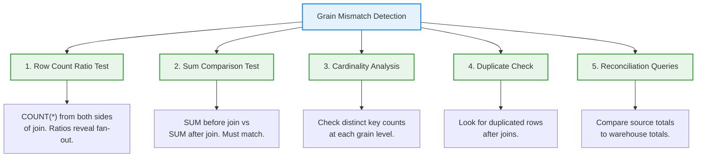
```mermaid
flowchart TD
    A[Grain Mismatch Detection] --> B["1. Row Count Ratio Test"]
    A --> C["2. Sum Comparison Test"]
    A --> D["3. Cardinality Analysis"]
    A --> E["4. Duplicate Check"]
    A --> F["5. Reconciliation Queries"]

    B --> B1["COUNT(*) from both sides<br/>of join. Ratios reveal fan-out."]
    C --> C1["SUM before join vs<br/>SUM after join. Must match."]
    D --> D1["Check distinct key counts<br/>at each grain level."]
    E --> E1["Look for duplicated rows<br/>after joins."]
    F --> F1["Compare source totals<br/>to warehouse totals."]

    style A fill:#e3f2fd,stroke:#1e88e5,stroke-width:2px
    style B fill:#e8f5e9,stroke:#43a047,stroke-width:2px
    style C fill:#e8f5e9,stroke:#43a047,stroke-width:2px
    style D fill:#e8f5e9,stroke:#43a047,stroke-width:2px
    style E fill:#e8f5e9,stroke:#43a047,stroke-width:2px
    style F fill:#e8f5e9,stroke:#43a047,stroke-width:2px
```

### 8.2 SQL Detection Queries

```sql
-- Detection 1: Row count ratio (fan-out detection)
SELECT 
    'Orders' AS SourceTable,
    COUNT(*) AS RowCount,
    COUNT(DISTINCT OrderID) AS DistinctOrders,
    CAST(COUNT(*) AS FLOAT) / COUNT(DISTINCT OrderID) AS FanOutRatio
FROM OrderItems;
-- FanOutRatio > 1 means multiple items per order (expected)
-- But if you join to order-level data, this ratio causes duplication

-- Detection 2: Sum before vs after join
-- BEFORE join
SELECT SUM(ShippingCost) AS ShippingBefore FROM Orders;
-- Expected: $8.00

-- AFTER join (wrong)
SELECT SUM(o.ShippingCost) AS ShippingAfter 
FROM OrderItems i 
JOIN Orders o ON i.OrderID = o.OrderID;
-- If > $8.00, you have grain mismatch!

-- Detection 3: Duplicate detection after join
SELECT 
    i.OrderID, 
    i.LineNum,
    COUNT(*) AS RowDuplicates
FROM OrderItems i
JOIN Orders o ON i.OrderID = o.OrderID
JOIN Coupons c ON i.OrderID = c.OrderID
GROUP BY i.OrderID, i.LineNum
HAVING COUNT(*) > 1;
-- Any rows returned indicate potential grain issue

-- Detection 4: Reconciliation
SELECT 
    'Source' AS System,
    SUM(Quantity * UnitPrice) AS TotalRevenue
FROM OrderItems
UNION ALL
SELECT 
    'Warehouse' AS System,
    SUM(LineTotal) AS TotalRevenue
FROM FactOrderLine;
-- Both must match exactly
```

### 8.3 Automated Detection Framework

```mermaid
flowchart TD
    subgraph Ingestion["Data Ingestion"]
        I1[Extract]
        I2[Transform]
        I3[Load]
    end

    subgraph Validation["Grain Validation Layer"]
        V1["Row Count Check"]
        V2["Sum Check"]
        V3["Cardinality Check"]
        V4["Uniqueness Check"]
    end

    subgraph Actions["Action Router"]
        A1["✅ Pass → Continue"]
        A2["⚠️ Warn → Log & Continue"]
        A3["❌ Fail → Stop & Alert"]
    end

    I1 --> I2 --> I3
    I3 --> V1 --> V2 --> V3 --> V4
    V1 --> Actions
    V2 --> Actions
    V3 --> Actions
    V4 --> Actions

    style Validation fill:#fff3e0,stroke:#fb8c00,stroke-width:3px
    style Actions fill:#e3f2fd,stroke:#1e88e5,stroke-width:2px
```

---

## 9. Strategy Selection Decision Framework

```mermaid
flowchart TD
    A["Grain Mismatch Identified"] --> B{"Is the mismatched data<br/>additive & allocatable?"}
    B -->|Yes| C{"Is approximate allocation<br/>business-acceptable?"}
    B -->|No| D{"Is the data needed<br/>in the same query?"}
    
    C -->|Yes| E["✅ Strategy 1: Allocation"]
    C -->|No| F["✅ Strategy 2: Separate Facts"]
    
    D -->|Yes| G{"Is it many-to-many?"}
    D -->|No| H["✅ Strategy 2: Separate Facts"]
    
    G -->|Yes| I["✅ Strategy 3: Bridge Table"]
    G -->|No| F

    style A fill:#ffebee,stroke:#e53935,stroke-width:2px
    style E fill:#e8f5e9,stroke:#43a047,stroke-width:2px
    style F fill:#e8f5e9,stroke:#43a047,stroke-width:2px
    style I fill:#e8f5e9,stroke:#43a047,stroke-width:2px
```

### 9.1 Strategy Comparison Matrix

| Criteria | Allocation | Separate Facts | Bridge Table |
|----------|------------|----------------|--------------|
| **Data Accuracy** | Approximate | Exact | Exact |
| **ETL Complexity** | Medium | Medium | High |
| **Query Complexity** | Low | Medium | High |
| **Storage Cost** | Low | Medium | High |
| **Auditability** | Poor | Excellent | Good |
| **Flexibility** | Low | High | Medium |
| **Best For** | Shipping, tax, discounts | Order-level attributes | Multi-valued dimensions |
| **Risk Level** | Medium (rounding) | Low | High (complexity) |

---

## 10. Real-World Scenarios

### 10.1 Scenario Matrix

```mermaid
quadrantChart
    title When to Use Which Strategy
    x-axis Low Accuracy Need --> High Accuracy Need
    y-axis Simple Query Need --> Complex Query Need
    quadrant-1 "High Accuracy, Complex Queries"
    quadrant-2 "High Accuracy, Simple Queries"
    quadrant-3 "Low Accuracy, Simple Queries"
    quadrant-4 "Low Accuracy, Complex Queries"
    "Allocation (Shipping)": [0.25, 0.25]
    "Allocation (Tax)": [0.2, 0.3]
    "Separate Facts (Orders)": [0.8, 0.4]
    "Separate Facts (Budgets)": [0.85, 0.35]
    "Bridge (Coupons)": [0.7, 0.75]
    "Bridge (Multi-seller)": [0.75, 0.8]
```

### 10.2 Common Domain Patterns

```mermaid
flowchart TD
    subgraph Retail["🛒 Retail"]
        R1["Shipping → Allocate"]
        R2["Coupons → Bridge or Separate"]
        R3["Tax → Allocate"]
        R4["Returns → Separate Fact"]
    end

    subgraph Finance["💰 Finance"]
        F1["Budgets → Separate Fact"]
        F2["FX Rates → Allocate to txn grain"]
        F3["Fees → Allocate"]
        F4["Interest → Separate Fact"]
    end

    subgraph Healthcare["🏥 Healthcare"]
        H1["Diagnoses → Bridge (many per visit)"]
        H2["Medications → Bridge (many per visit)"]
        H3["Charges → Separate Fact"]
        H4["Payments → Allocate to charges"]
    end

    subgraph AdTech["📢 AdTech"]
        A1["Impressions → Hourly Fact"]
        A2["Billing → Daily Fact (Separate)"]
        A3["Clicks → Allocate revenue"]
        A4["Conversions → Separate Fact"]
    end

    style Retail fill:#e3f2fd,stroke:#1e88e5,stroke-width:2px
    style Finance fill:#e8f5e9,stroke:#43a047,stroke-width:2px
    style Healthcare fill:#fff3e0,stroke:#fb8c00,stroke-width:2px
    style AdTech fill:#f3e5f5,stroke:#8e24aa,stroke-width:2px
```

---

## 11. ETL Pipeline Patterns for Grain Safety

### 11.1 Safe Loading Sequence

```mermaid
sequenceDiagram
    participant S as Source Systems
    participant E as ETL
    participant DW as Data Warehouse
    participant V as Validation

    S->>E: Extract raw data
    E->>E: Stage raw data (preserve source grain)
    E->>V: Run grain validation checks
    V->>V: Row count, sum, cardinality
    alt Validation Passes
        V->>E: ✅ Continue
        E->>DW: Load dimensions first
        E->>DW: Load facts (grain-enforced)
        E->>V: Post-load reconciliation
        V->>V: Source totals = DW totals?
        alt Reconciliation Passes
            V->>E: ✅ Commit
        else Reconciliation Fails
            V->>E: ❌ Rollback & Alert
        end
    else Validation Fails
        V->>E: ❌ Stop pipeline & Alert
    end
```

### 11.2 Grain Documentation Template

```mermaid
flowchart TD
    subgraph Template["Fact Table Grain Document"]
        T1["📋 Table Name"]
        T2["📝 Grain Statement<br/>'One row per...'"]
        T3["🔑 Primary Key Columns"]
        T4["🔗 Foreign Key Columns"]
        T5["📊 Measure Columns"]
        T6["📌 Source Tables & Their Grains"]
        T7["⚠️ Known Grain Mismatches"]
        T8["🔧 Handling Strategy Used"]
        T9["✅ Validation Queries"]
    end

    T1 --> T2 --> T3 --> T4 --> T5 --> T6 --> T7 --> T8 --> T9

    style Template fill:#f5f5f5,stroke:#616161,stroke-width:2px
    style T2 fill:#ffebee,stroke:#e53935,stroke-width:3px
    style T7 fill:#fff3e0,stroke:#fb8c00,stroke-width:2px
    style T8 fill:#e8f5e9,stroke:#43a047,stroke-width:2px
```

---

## 12. Common Mistakes & Anti-Patterns

```mermaid
flowchart TD
    A["Grain Mismatch Anti-Patterns"] --> M1
    A --> M2
    A --> M3
    A --> M4
    A --> M5
    A --> M6
    A --> M7

    M1["❌ Blind JOIN without<br/>checking cardinality"]
    M2["❌ SUMming pre-joined data<br/>without verifying totals"]
    M3["❌ Using DISTINCT to hide<br/>duplicates instead of fixing grain"]
    M4["❌ Documenting grain as<br/>'fine' or 'detailed'<br/>instead of a precise statement"]
    M5["❌ Changing grain mid-project<br/>without migrating existing data"]
    M6["❌ Assuming source grain<br/>matches target grain"]
    M7["❌ Ignoring temporal grain<br/>in date joins"]

    M1 --> M1C["Results: Inflated numbers"]
    M2 --> M2C["Results: Wrong reports"]
    M3 --> M3C["Results: Hidden errors,<br/>silent data loss"]
    M4 --> M4C["Results: Ambiguity,<br/>future mismatches"]
    M5 --> M5C["Results: Mixed-grain table,<br/>unreliable data"]
    M6 --> M6C["Results: Fan-out or<br/>fragmentation errors"]
    M7 --> M7C["Results: Time-based<br/>duplication errors"]

    style A fill:#ffebee,stroke:#e53935,stroke-width:2px
    style M1 fill:#ffcdd2,stroke:#e53935,stroke-width:1px
    style M2 fill:#ffcdd2,stroke:#e53935,stroke-width:1px
    style M3 fill:#ffcdd2,stroke:#e53935,stroke-width:1px
    style M4 fill:#ffcdd2,stroke:#e53935,stroke-width:1px
    style M5 fill:#ffcdd2,stroke:#e53935,stroke-width:1px
    style M6 fill:#ffcdd2,stroke:#e53935,stroke-width:1px
    style M7 fill:#ffcdd2,stroke:#e53935,stroke-width:1px
    style M1C fill:#fff9c4,stroke:#f9a825,stroke-width:1px
    style M2C fill:#fff9c4,stroke:#f9a825,stroke-width:1px
    style M3C fill:#fff9c4,stroke:#f9a825,stroke-width:1px
    style M4C fill:#fff9c4,stroke:#f9a825,stroke-width:1px
    style M5C fill:#fff9c4,stroke:#f9a825,stroke-width:1px
    style M6C fill:#fff9c4,stroke:#f9a825,stroke-width:1px
    style M7C fill:#fff9c4,stroke:#f9a825,stroke-width:1px
```

---

## 13. Checklist: Grain-Safe Pipeline

```mermaid
flowchart TD
    subgraph Design["Design Phase"]
        D1["☑ Write grain statement as sentence"]
        D2["☑ Document every source table's grain"]
        D3["☑ Identify all grain mismatches"]
        D4["☑ Choose handling strategy per mismatch"]
        D5["☑ Design validation queries"]
    end

    subgraph Build["Build Phase"]
        B1["☑ Implement grain-aware ETL"]
        B2["☑ Add allocation logic with rounding fix"]
        B3["☑ Create separate facts if needed"]
        B4["☑ Build bridge tables if needed"]
        B5["☑ Add grain documentation to DAG/metadata"]
    end

    subgraph Test["Test Phase"]
        T1["☑ Row count validation"]
        T2["☑ Sum reconciliation"]
        T3["☑ Cardinality checks"]
        T4["☑ Edge case testing (single line, multi-line)"]
        T5["☑ Temporal grain testing"]
    end

    subgraph Operate["Operate Phase"]
        O1["☑ Automated validation in pipeline"]
        O2["☑ Alerts on grain violations"]
        O3["☑ Periodic reconciliation audits"]
        O4["☑ Grain docs updated on schema changes"]
    end

    Design --> Build --> Test --> Operate

    style Design fill:#e3f2fd,stroke:#1e88e5,stroke-width:2px
    style Build fill:#fff3e0,stroke:#fb8c00,stroke-width:2px
    style Test fill:#f3e5f5,stroke:#8e24aa,stroke-width:2px
    style Operate fill:#e8f5e9,stroke:#43a047,stroke-width:2px
```

---

## 14. Conclusion

```mermaid
graph TD
    A["Grain Mismatch Handling"] --> B["Understand grain first"]
    A --> C["Detect mismatches early"]
    A --> D["Choose the right strategy"]
    A --> E["Validate relentlessly"]
    A --> F["Document precisely"]

    B --> G["✅ Correct data"]
    C --> G
    D --> G
    E --> G
    F --> G

    G --> H["🎯 Trustworthy Analytics<br/>📊 Reliable Decisions<br/>🛡️ Data Confidence"]

    style A fill:#e3f2fd,stroke:#1e88e5,stroke-width:2px
    style G fill:#e8f5e9,stroke:#43a047,stroke-width:3px
    style H fill:#f3e5f5,stroke:#8e24aa,stroke-width:2px
```

> **The Golden Rule of Grain:** If you cannot write a single, unambiguous sentence describing what one row represents, you are not ready to load data. Grain mismatch is not a bug — it is a symptom of undefined grain. Define it, lock it, enforce it, validate it.
