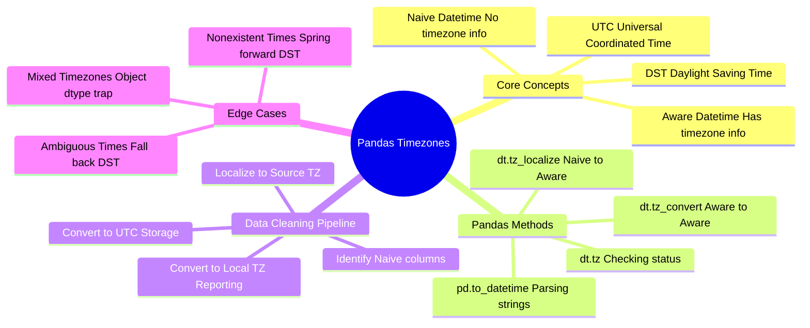
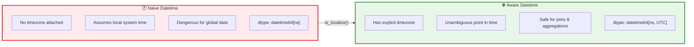
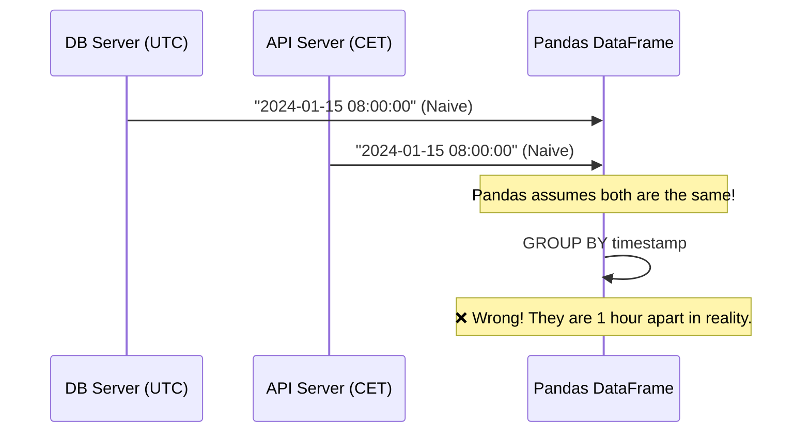
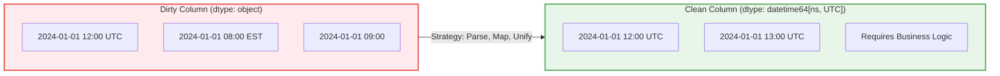
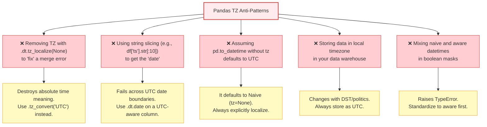
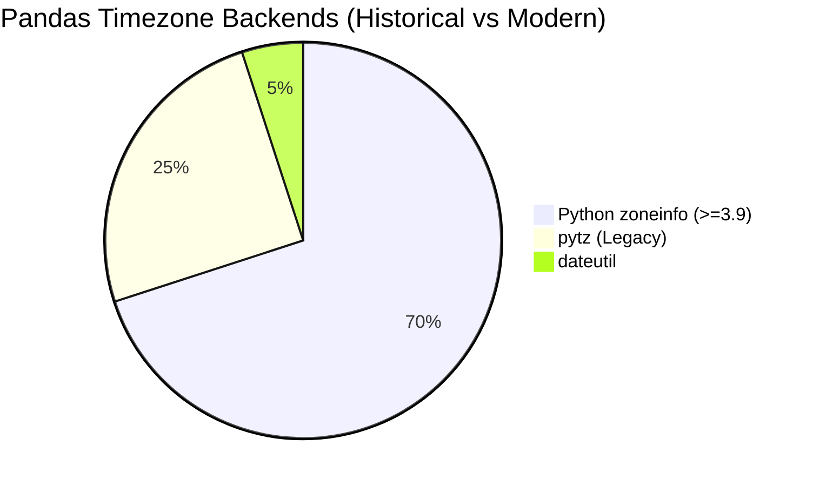

# Data Cleaning: Handling Timezones in Pandas

## Executive Summary

Handling timezones in Pandas is one of the most critical yet frequently botched tasks in data cleaning. Failing to manage timezones leads to silent data duplication during joins, incorrect aggregations, and distorted time-series analysis. The core strategy in Pandas revolves around two distinct operations: **`tz_localize`** (adding a timezone to a naive datetime) and **`tz_convert`** (changing the timezone of an aware datetime). The golden rule is simple: **Parse it, Localize it, Convert to UTC.**



---

## 1. The Fundamental Problem: Naive vs. Aware

Before writing a single line of Pandas code, you must understand the difference between Naive and Aware datetime objects. Pandas treats these completely differently.



### Why Naive Datetimes Destroy Data Pipelines



---

## 2. The Pandas Timezone Decision Flow

Never guess when dealing with timezones. Follow this strict decision tree during data cleaning.

```mermaid
flowchart TD
    A[Import DateTime Column] --> B{Is it a string?}
    B -->|Yes| C["pd.to_datetime()"]
    B -->|No| D{Check dtype:<br/>datetime64[ns]?}
    C --> D
    D -->|No, it's object| C
    D -->|Yes| E{Check .dt.tz:<br/>Is it None?}
    
    E -->|Yes, it's Naive| F{Do you know<br/>the source timezone?}
    F -->|Yes| G["✅ .dt.tz_localize('Source/TZ')"]
    F -->|No| H["❌ STOP. Find out.<br/>Do NOT assume UTC."]
    
    E -->|No, it's Aware| I{Is it already UTC?}
    
    G --> J["✅ .dt.tz_convert('UTC')"]
    I -->|Yes| K["✅ Ready for storage/joins"]
    I -->|No| J
    
    H --> L["💀 Data Integrity Risk"]
    J --> K

    style H fill:#ffebee,stroke:#e53935,stroke-width:3px
    style L fill:#ffebee,stroke:#e53935,stroke-width:3px
    style K fill:#e8f5e9,stroke:#43a047,stroke-width:3px
    style G fill:#fff3e0,stroke:#fb8c00,stroke-width:2px
    style J fill:#fff3e0,stroke:#fb8c00,stroke-width:2px
```

---

## 3. Step-by-Step Implementation

### Step 1: Parsing Strings to Datetime

The foundation of all timezone work is ensuring Pandas recognizes the column as a datetime object, not strings (object dtype).

```python
import pandas as pd

# Dirty data: mixed formats, missing values
df = pd.DataFrame({
    'event_id': [1, 2, 3],
    'timestamp_str': ['2024-01-15 08:30:00', '15/01/2024 14:00', '2024-01-16T09:15:00Z']
})

# ✅ CLEAN: Use pd.to_datetime with infer_datetime_format or format spec
df['timestamp_dt'] = pd.to_datetime(df['timestamp_str'], format='mixed')

print(df['timestamp_dt'].dtype)
# Output: datetime64[ns]
```

### Step 2: Localizing (Naive → Aware)

If your data came from a system in New York, but lacks timezone info, you must *localize* it. **Warning:** You can only localize a Naive datetime.

```python
# Assuming timestamps are from New York (EST/EDT)
df['ts_ny'] = df['timestamp_dt'].dt.tz_localize('America/New_York')

print(df['ts_ny'].dtype)
# Output: datetime64[ns, America/New_York]

# ❌ FATAL ERROR: Trying to localize an already Aware datetime
# df['ts_ny'].dt.tz_localize('UTC') 
# Raises: TypeError: Cannot localize tz-aware Timestamp, use tz_convert
```

### Step 3: Converting (Aware → Aware)

Once data is localized (or if it came with a timezone like the 'Z' in row 3), you convert it to other timezones. The underlying absolute point in time (UTC) does not change; only the representation changes.

```python
# Convert New York time to UTC (Standard for database storage)
df['ts_utc'] = df['ts_ny'].dt.tz_convert('UTC')

# Convert UTC to Tokyo time (For reporting)
df['ts_tokyo'] = df['ts_utc'].dt.tz_convert('Asia/Tokyo')
```

---

## 4. The Daylight Saving Time (DST) Trap

This is where 90% of Pandas timezone bugs live. When clocks "spring forward" or "fall back," specific times either don't exist or happen twice. `tz_localize` will crash by default if it hits these.

### 4.1 The Problem Visualized

```mermaid
gantt
    title The DST Transition Problem
    dateFormat HH:mm
    axisFormat %H:%M
    
    section Spring Forward (Nonexistent)
    Normal Time    :02:00, 01:00
    Missing Hour   :03:00, 01:00, crit, active, 02:00, 02:00
    Normal Time    :04:00, 01:00
    
    section Fall Back (Ambiguous)
    Normal Time    :00:00, 01:00
    1st Occurrence :01:30, 00:30, active, 00:30, 00:30
    Clocks Roll Back:02:00, 00:30, crit, 00:00, 00:00
    2nd Occurrence :01:30, 00:30, active, 00:30, 00:30
    Normal Time    :02:30, 00:30
```

### 4.2 Handling Nonexistent Times (Spring Forward)

At 2:00 AM, clocks jump to 3:00 AM. 2:30 AM does not exist.

```python
# Data containing a nonexistent time
s_naive = pd.Series(pd.to_datetime(['2024-03-10 01:30:00', '2024-03-10 02:30:00']))

# ❌ CRASH: NonExistentTimeError
# s_naive.dt.tz_localize('America/New_York')

# ✅ FIX 1: Shift forward to the next valid time (default behavior with flag)
s_fixed = s_naive.dt.tz_localize('America/New_York', nonexistent='shift_forward')
# '2024-03-10 02:30:00' becomes '2024-03-10 03:00:00'

# ✅ FIX 2: Shift backward to the previous valid time
s_fixed = s_naive.dt.tz_localize('America/New_York', nonexistent='shift_backward')
# '2024-03-10 02:30:00' becomes '2024-03-10 01:59:59.999999'

# ✅ FIX 3: Fill with a specific timezone (e.g., assume UTC rules for that moment)
s_fixed = s_naive.dt.tz_localize('America/New_York', nonexistent='NaT')
# Fills with NaT (Not a Time) - safest for strict data integrity
```

### 4.3 Handling Ambiguous Times (Fall Back)

At 2:00 AM, clocks fall back to 1:00 AM. 1:30 AM happens twice.

```python
# Data containing an ambiguous time
s_naive = pd.Series(pd.to_datetime(['2024-11-03 01:30:00']))

# ❌ CRASH: AmbiguousTimeError
# s_naive.dt.tz_localize('America/New_York')

# ✅ FIX 1: Assume the first occurrence (Daylight Time, EDT, UTC-4)
s_fixed = s_naive.dt.tz_localize('America/New_York', ambiguous='infer')
# or explicitly: ambiguous=True (which means first occurrence)

# ✅ FIX 2: Assume the second occurrence (Standard Time, EST, UTC-5)
s_fixed = s_naive.dt.tz_localize('America/New_York', ambiguous=False)

# ✅ FIX 3: Provide an array mapping each row to True/False
s_fixed = s_naive.dt.tz_localize('America/New_York', ambiguous=[True])
```

---

## 5. Cleaning Mixed Timezones in a Single Column

Often, dirty data arrives with some rows having UTC, some having local time, and some having no timezone. Pandas forces these into `object` dtype, destroying vectorized operations.



### The Solution: Extract, Fix, Re-apply

```python
# Mixed timezone data forces object dtype
mixed_tz = pd.Series([
    pd.Timestamp('2024-01-01 12:00:00', tz='UTC'),
    pd.Timestamp('2024-01-01 08:00:00', tz='America/New_York'),
    '2024-01-01 09:00:00' # Naive string
])

print(mixed_tz.dtype) # object

# ✅ CLEANING STRATEGY:
# 1. Convert everything to UTC iteratively or via a helper function
def clean_mixed_tz(series, assumed_naive_tz='America/New_York'):
    cleaned = []
    for val in series:
        ts = pd.to_datetime(val)
        
        if pd.isna(ts):
            cleaned.append(pd.NaT)
            continue
            
        if ts.tz is None:
            # It's naive, localize it based on your assumption
            ts = ts.tz_localize(assumed_naive_tz)
            
        # Now it is Aware, convert to UTC
        cleaned.append(ts.tz_convert('UTC'))
        
    return pd.Series(cleaned)

clean_series = clean_mixed_tz(mixed_tz)
print(clean_series.dtype) # datetime64[ns, UTC]
```

---

## 6. Impact on Data Operations

Timezones fundamentally change how Pandas executes core data wrangling tasks.

### 6.1 Merging / Joining Data

```mermaid
flowchart TD
    subgraph Wrong["❌ Merging Naive Datetimes"]
        W1[Table A: "08:00" Local] 
        W2[Table B: "08:00" Local]
        W1 -->|INNER JOIN| W3[Match! (Incorrect if TZs differ)]
    end

    subgraph Right["✅ Merging Aware Datetimes (UTC)"]
        R1[Table A: "13:00 UTC"]
        R2[Table B: "13:00 UTC"]
        R1 -->|INNER JOIN| R3[Match! (Accurate absolute time)]
        R1 -->|Different row: "14:00 UTC"| R4[No Match (Correctly excluded)]
    end

    style Wrong fill:#ffebee,stroke:#e53935,stroke-width:2px
    style Right fill:#e8f5e9,stroke:#43a047,stroke-width:2px
```

### 6.2 Resampling and Grouping

When you resample time-series data, Pandas needs to know the timezone to calculate boundaries correctly (e.g., "Give me the daily sum"). If you resample naive data, Pandas uses your machine's local timezone, which will break when deployed to a server in a different region.

```python
# Ensure data is UTC before resampling for consistent day boundaries
df_utc = df.copy()
df_utc['ts_utc'] = pd.to_datetime(df_utc['timestamp_str']).dt.tz_localize('UTC')

# ✅ Safe Resampling: Days always start at 00:00 UTC
daily_sum = df_utc.set_index('ts_utc').resample('D')['value'].sum()

# If you need it in a local timezone for a report, convert AFTER resampling
daily_sum.index = daily_sum.index.tz_convert('America/Los_Angeles')
```

---

## 7. Anti-Patterns & Common Mistakes



---

## 8. The Ultimate Timezone Cleaning Recipe

Use this standard operating procedure for every datetime column entering your Pandas environment.

```mermaid
flowchart TD
    Start([Read CSV / DB / API]) --> Step1[Step 1: Parse Strings<br/>pd.to_datetime(col, format='...')]
    Step1 --> Step2{Step 2: Check .dt.tz}
    Step2 -->|Is None| Step3[Step 3: Identify Source System TZ]
    Step3 --> Step4[Step 4: Localize<br/>.dt.tz_localize('Source/TZ', ambiguous=..., nonexistent=...)]
    Step2 -->|Has Value| Step5[Step 5: Skip Localize]
    Step4 --> Step6[Step 6: Convert to UTC<br/>.dt.tz_convert('UTC')]
    Step5 --> Step6
    Step6 --> Step7[Step 7: Validate<br/>Check for NaTs, check min/max dates]
    Step7 --> Step8([Proceed to Joins & Analysis])
    
    style Start fill:#e3f2fd,stroke:#1e88e5,stroke-width:2px
    style Step4 fill:#fff3e0,stroke:#fb8c00,stroke-width:2px
    style Step6 fill:#e8f5e9,stroke:#43a047,stroke-width:3px
    style Step8 fill:#e8f5e9,stroke:#43a047,stroke-width:3px
```

### The Copy-Paste Safe Function

```python
def clean_timezone_column(series: pd.Series, source_tz: str) -> pd.Series:
    """
    Standardizes a pandas Series to UTC.
    Handles strings, naive datetimes, and DST edge cases.
    """
    # 1. Parse to datetime if it's a string
    if pd.api.types.is_string_dtype(series) or pd.api.types.is_object_dtype(series):
        series = pd.to_datetime(series, errors='coerce')
        
    # 2. Handle NaT values early
    mask_nat = series.isna()
    
    # 3. Localize if naive
    if series.dt.tz is None:
        series = series.dt.tz_localize(
            source_tz, 
            ambiguous='infer',   # Assumes DST fall-back is the first occurrence
            nonexistent='shift_forward' # Skips the missing hour in spring
        )
        
    # 4. Convert to UTC
    series = series.dt.tz_convert('UTC')
    
    # 5. Re-apply NaT mask (in case coerce created NaTs we want to keep)
    series[mask_nat] = pd.NaT
    
    return series

# Usage:
# df['clean_timestamp'] = clean_timezone_column(df['dirty_timestamp'], 'America/New_York')
```

---

## 9. Modern Pandas: Moving away from `pytz`



> **Strategic Note:** Since Pandas 2.0+, the Python standard library `zoneinfo` is the preferred timezone backend over `pytz`. 
> * **Old way:** `tz_localize(pytz.timezone('US/Eastern'))`
> * **New way:** `tz_localize('America/New_York')` (Pandas passes this to `zoneinfo` automatically in modern versions).
> 
> Always use the IANA timezone database names (e.g., `'America/New_York'`, `'Europe/London'`, `'Asia/Tokyo'`). Never use fixed offsets like `+05:00` unless dealing with legacy systems that explicitly do not observe DST.
