# Fact Tables vs. Dimension Tables Explained

## Executive Summary

Fact tables and dimension tables are the two fundamental building blocks of dimensional modeling in data warehousing. Understanding their distinct roles, characteristics, and relationships is essential for designing effective analytical systems that support business intelligence and reporting needs.

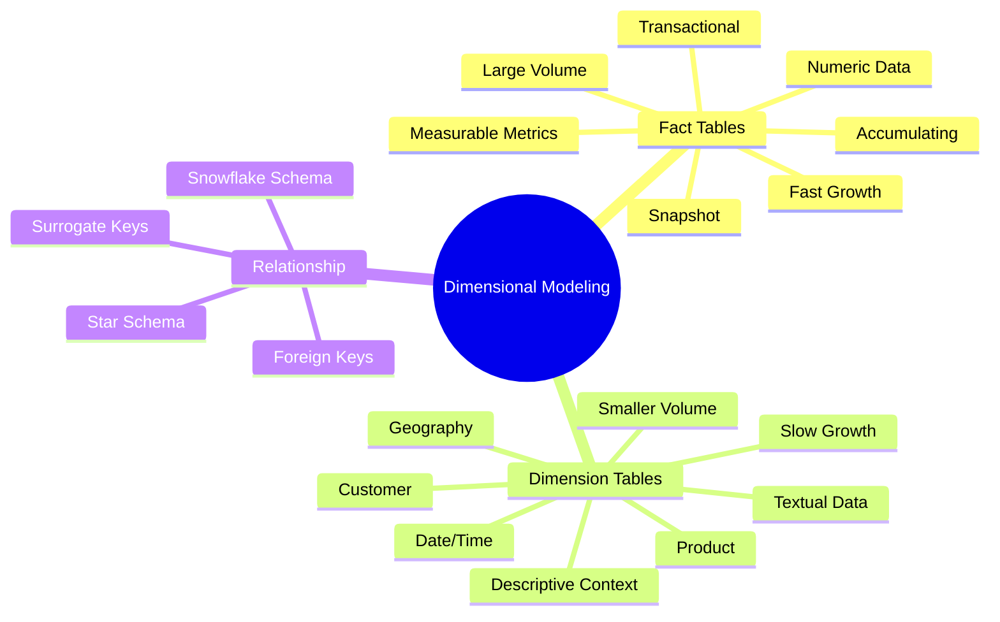

---

## 1. Introduction to Dimensional Modeling

Dimensional modeling is a design approach used in data warehousing to structure data in a way that optimizes query performance for analytical workloads. It organizes data into two primary types of tables:

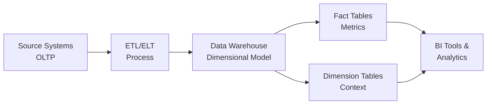

---

## 2. Fact Tables: The Metrics

### 2.1 Definition and Purpose
Fact tables store the quantitative measurements or metrics of a business process. They represent the "what" happened in a business event and typically contain numerical values that can be aggregated, analyzed, and calculated.

### 2.2 Characteristics of Fact Tables

| Characteristic | Description |
|----------------|-------------|
| **Content** | Numeric measurements, foreign keys to dimensions |
| **Size** | Typically very large (millions to billions of rows) |
| **Growth** | Continuously growing as new events occur |
| **Structure** | Long and narrow (few columns, many rows) |
| **Primary Key** | Composite key made up of dimension foreign keys |
| **Examples of Data** | Sales amount, quantity sold, discount amount, transaction count |

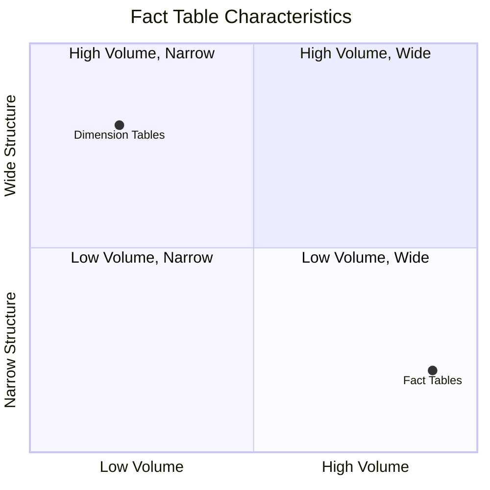

### 2.3 Types of Fact Tables

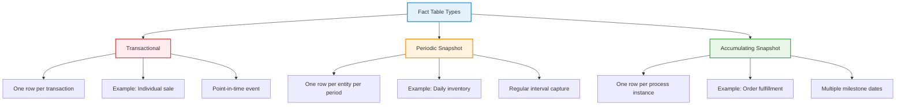

### 2.4 Fact Table Structure

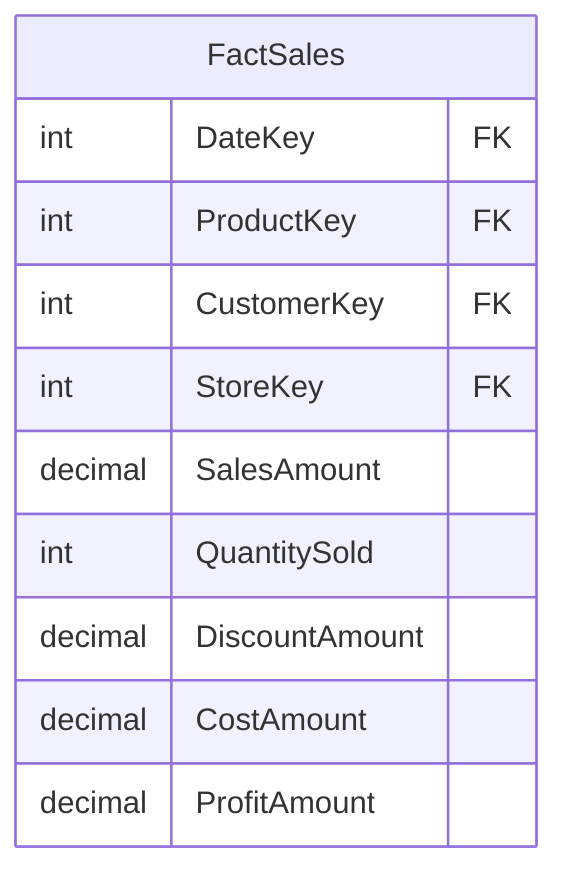

### 2.5 Fact Table Grain
The grain of a fact table defines what exactly one row represents. It's critical to clearly define and consistently maintain the grain.

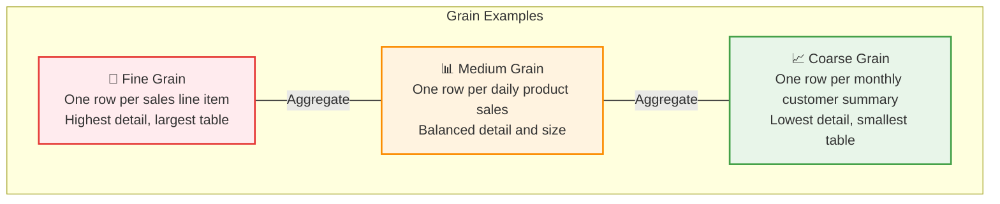

---

## 3. Dimension Tables: The Context

### 3.1 Definition and Purpose
Dimension tables contain the descriptive attributes that provide context to the facts. They represent the "who, what, where, when, and why" aspects of the business events stored in fact tables.

### 3.2 Characteristics of Dimension Tables

| Characteristic | Description |
|----------------|-------------|
| **Content** | Descriptive attributes, textual information |
| **Size** | Typically smaller than fact tables (thousands to millions of rows) |
| **Growth** | Slower growth rate compared to fact tables |
| **Structure** | Wide and short (many columns, fewer rows) |
| **Primary Key** | Single surrogate key column |
| **Examples of Data** | Product name, customer name, store location, date attributes |

### 3.3 Common Dimension Tables

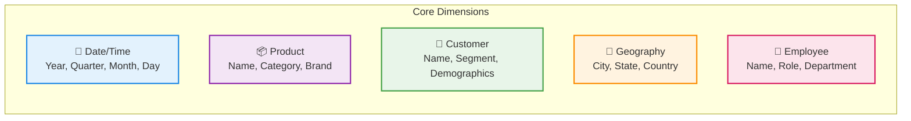

### 3.4 Dimension Table Structure

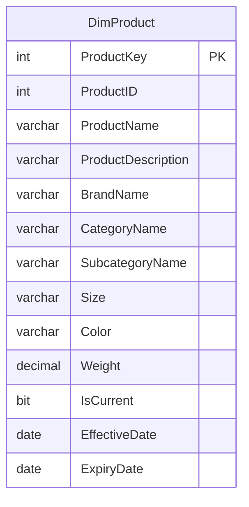

### 3.5 Slowly Changing Dimensions (SCD)

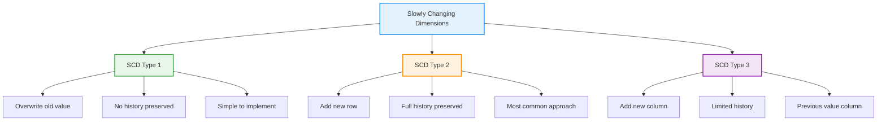

---

## 4. The Relationship Between Facts and Dimensions

### 4.1 Star Schema

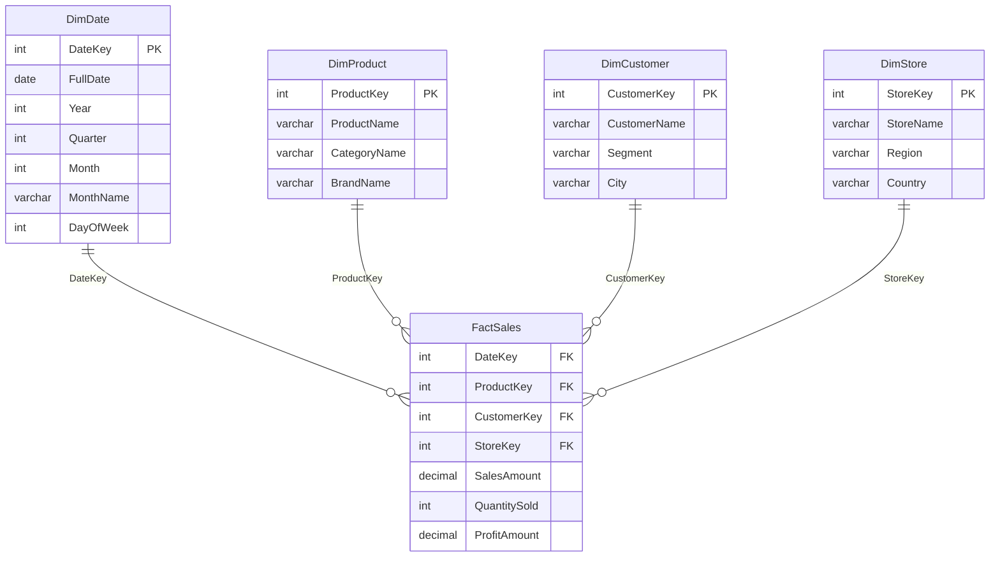

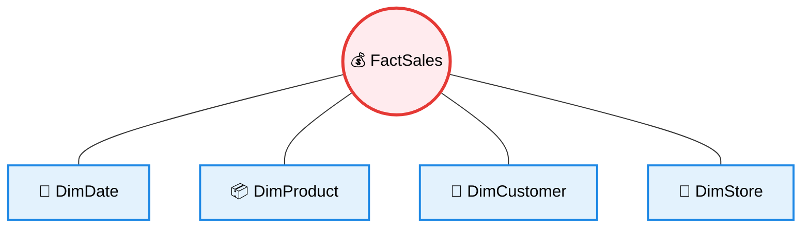

### 4.2 Snowflake Schema

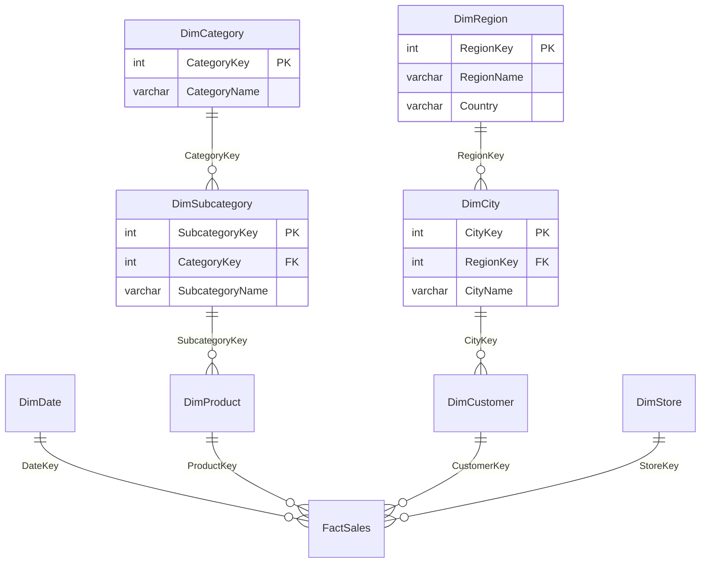

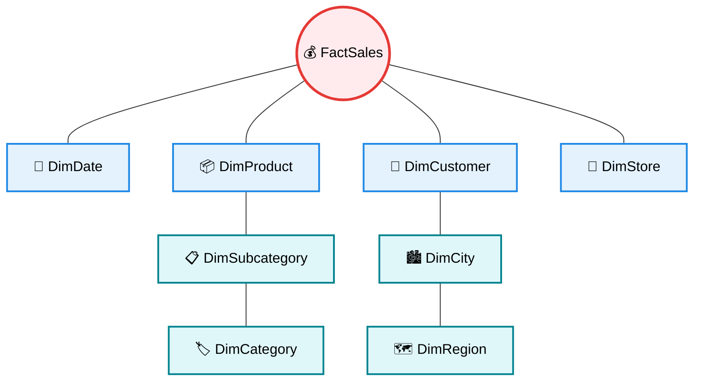

### 4.3 Query Flow: How Facts and Dimensions Work Together

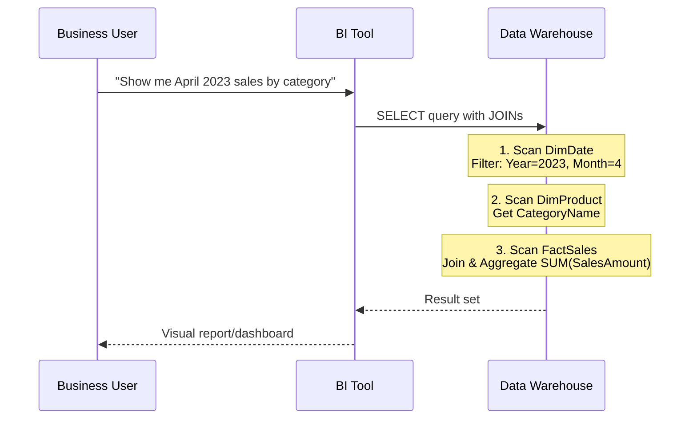

---

## 5. Key Differences Between Fact and Dimension Tables

### 5.1 Comparison Table

| Aspect | Fact Tables | Dimension Tables |
|--------|-------------|------------------|
| **Primary Purpose** | Store measurable business metrics | Provide descriptive context |
| **Data Type** | Mostly numeric | Mostly textual |
| **Size** | Very large (millions to billions of rows) | Smaller (thousands to millions of rows) |
| **Growth Rate** | Rapid growth | Slower growth |
| **Structure** | Long and narrow | Wide and short |
| **Keys** | Foreign keys to dimensions | Primary surrogate key |
| **Usage** | Subject of analysis | Used for filtering, grouping, labeling |
| **Examples** | Sales amount, quantity, discount | Product name, customer segment, date |

### 5.2 Visual Comparison

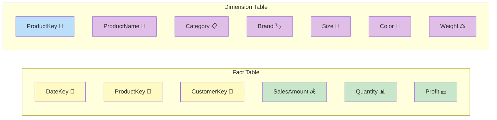

### 5.3 Attribute Type Distribution

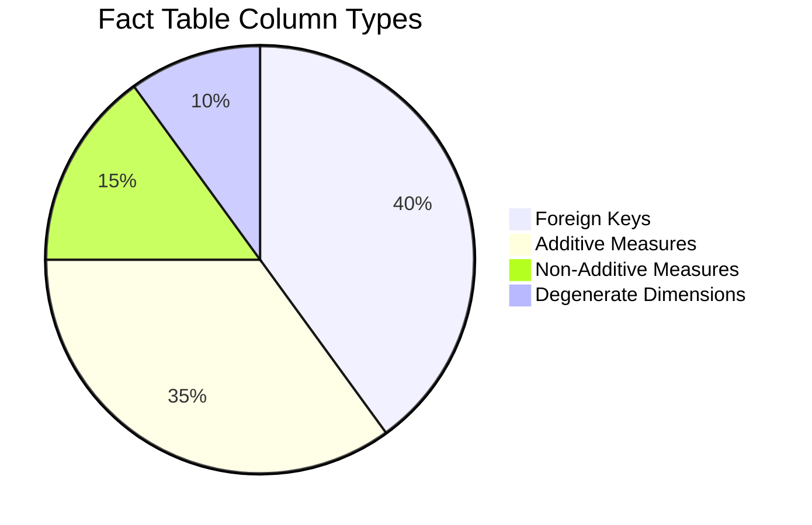

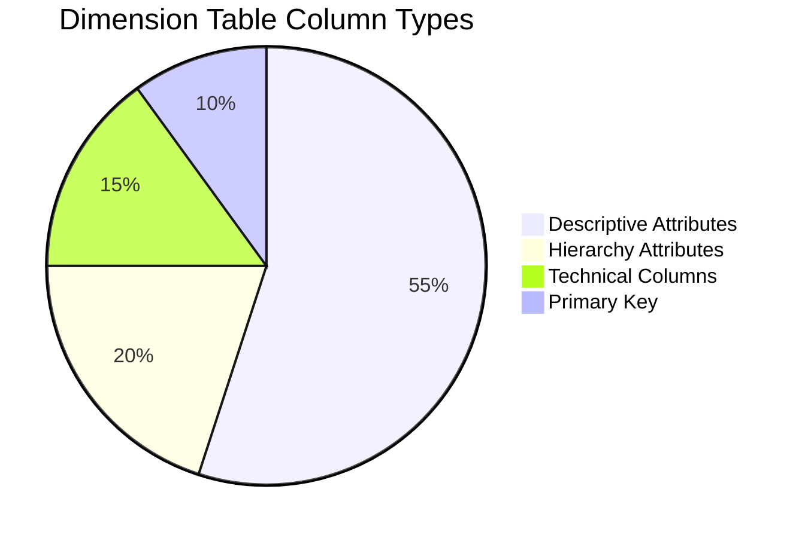

---

## 6. Best Practices for Fact and Dimension Tables

### 6.1 Fact Table Best Practices

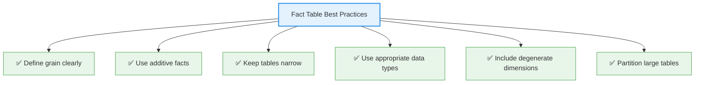

### 6.2 Dimension Table Best Practices

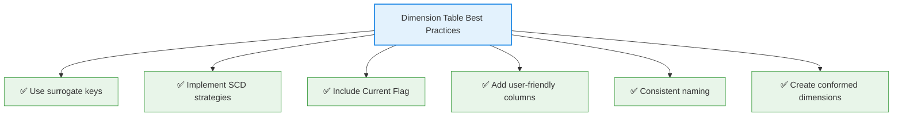

### 6.3 Decision Flow: Surrogate Keys vs Natural Keys

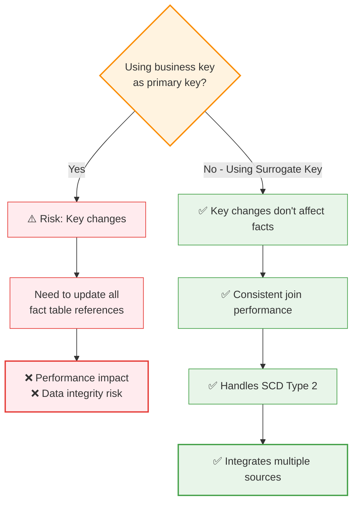

---

## 7. Common Mistakes to Avoid

```mermaid
flowchart TD
    A[Common Mistakes] --> M1["❌ Mixing facts & dimensions"]
    A --> M2["❌ Undefined grain"]
    A --> M3["❌ Wrong granularity"]
    A --> M4["❌ Ignoring SCDs"]
    A --> M5["❌ Using natural keys"]
    A --> M6["❌ Over-normalizing"]

    M1 --> M1D["Storing metrics in dims<br/>or attributes in facts"]
    M2 --> M2D["Unclear row meaning<br/>leads to wrong results"]
    M3 --> M3D["Too detailed = size issues<br/>Too summarized = lost flexibility"]
    M4 --> M4D["Incorrect historical analysis"]
    M5 --> M5D["Broken references<br/>when keys change"]
    M6 --> M6D["Unnecessary complexity<br/>and slow queries"]

    style A fill:#ffebee,stroke:#e53935,stroke-width:2px
    style M1 fill:#ffcdd2,stroke:#e53935,stroke-width:1px
    style M2 fill:#ffcdd2,stroke:#e53935,stroke-width:1px
    style M3 fill:#ffcdd2,stroke:#e53935,stroke-width:1px
    style M4 fill:#ffcdd2,stroke:#e53935,stroke-width:1px
    style M5 fill:#ffcdd2,stroke:#e53935,stroke-width:1px
    style M6 fill:#ffcdd2,stroke:#e53935,stroke-width:1px
    style M1D fill:#fff9c4,stroke:#f9a825,stroke-width:1px
    style M2D fill:#fff9c4,stroke:#f9a825,stroke-width:1px
    style M3D fill:#fff9c4,stroke:#f9a825,stroke-width:1px
    style M4D fill:#fff9c4,stroke:#f9a825,stroke-width:1px
    style M5D fill:#fff9c4,stroke:#f9a825,stroke-width:1px
    style M6D fill:#fff9c4,stroke:#f9a825,stroke-width:1px
```

---

## 8. Complete Data Warehouse Architecture

```mermaid
flowchart TB
    subgraph Sources["Source Systems (OLTP)"]
        S1[🛒 E-Commerce DB]
        S2[📦 Inventory System]
        S3[👤 CRM System]
        S4[💰 Finance System]
    end

    subgraph ETL["ETL/ELT Pipeline"]
        E1[Extract]
        E2[Transform]
        E3[Load]
        E1 --> E2 --> E3
    end

    subgraph DW["Data Warehouse"]
        direction TB
        subgraph Staging["Staging Layer"]
            STG[Staging Tables]
        end
        
        subgraph DimLayer["Dimension Layer"]
            DD[📅 DimDate]
            DP[📦 DimProduct]
            DC[👤 DimCustomer]
            DS[🏪 DimStore]
            DE[👷 DimEmployee]
        end
        
        subgraph FactLayer["Fact Layer"]
            FS[💰 FactSales]
            FI[📊 FactInventory]
            FP[📈 FactPurchases]
        end
        
        STG --> DimLayer
        STG --> FactLayer
        DimLayer --> FactLayer
    end

    subgraph Consumption["Consumption Layer"]
        BI1[📊 Dashboards]
        BI2[📋 Reports]
        BI3[🔍 Ad-hoc Queries]
        BI4[🤖 ML Features]
    end

    Sources --> ETL --> DW --> Consumption

    style Sources fill:#e3f2fd,stroke:#1e88e5,stroke-width:2px
    style ETL fill:#fff3e0,stroke:#fb8c00,stroke-width:2px
    style DW fill:#e8f5e9,stroke:#43a047,stroke-width:2px
    style Consumption fill:#f3e5f5,stroke:#8e24aa,stroke-width:2px
    style FS fill:#ffebee,stroke:#e53935,stroke-width:3px
    style FI fill:#ffebee,stroke:#e53935,stroke-width:3px
    style FP fill:#ffebee,stroke:#e53935,stroke-width:3px
    style DD fill:#bbdefb,stroke:#1e88e5,stroke-width:2px
    style DP fill:#bbdefb,stroke:#1e88e5,stroke-width:2px
    style DC fill:#bbdefb,stroke:#1e88e5,stroke-width:2px
    style DS fill:#bbdefb,stroke:#1e88e5,stroke-width:2px
    style DE fill:#bbdefb,stroke:#1e88e5,stroke-width:2px
```

---

## 9. Quick Reference Card

```mermaid
flowchart LR
    subgraph Fact["Fact Table"]
        F1["🔢 Numeric measures"]
        F2["🔗 Foreign keys only"]
        F3["📏 Long & narrow"]
        F4["📈 Fast growing"]
    end
    
    subgraph Dim["Dimension Table"]
        D1["📝 Descriptive text"]
        D2["🔑 Surrogate key PK"]
        D3["📐 Wide & short"]
        D4["🐢 Slow growing"]
    end
    
    Fact ---|"JOIN on FK"| Dim

    style Fact fill:#ffebee,stroke:#e53935,stroke-width:3px
    style Dim fill:#e3f2fd,stroke:#1e88e5,stroke-width:3px
```

| Question | Answer |
|----------|--------|
| What stores the numbers? | **Fact Table** |
| What stores the descriptions? | **Dimension Table** |
| Which table is larger? | **Fact Table** |
| Which table has more columns? | **Dimension Table** |
| What does one fact row represent? | The **grain** (one business event) |
| What key connects them? | **Foreign Key** in fact → **Surrogate Key** in dimension |

---

## 10. Conclusion

```mermaid
graph TD
    A[Fact & Dimension Tables] --> B[Fact Tables]
    A --> C[Dimension Tables]
    
    B --> B1["Capture WHAT happened"]
    B --> B2["Quantifiable metrics"]
    B --> B3["Subject of analysis"]
    
    C --> C1["Provide CONTEXT"]
    C --> C2["Descriptive attributes"]
    C --> C3["Filter, Group, Label"]
    
    B1 --> D["Together they enable:"]
    C1 --> D
    B2 --> D
    C2 --> D
    B3 --> D
    C3 --> D
    
    D --> E1["⚡ Fast query performance"]
    D --> E2["🧠 Intuitive business understanding"]
    D --> E3["📊 Flexible reporting"]
    D --> E4["🔍 Deep analytical capabilities"]

    style A fill:#e3f2fd,stroke:#1e88e5,stroke-width:2px
    style B fill:#ffebee,stroke:#e53935,stroke-width:2px
    style C fill:#e8f5e9,stroke:#43a047,stroke-width:2px
    style D fill:#fff3e0,stroke:#fb8c00,stroke-width:2px
    style E1 fill:#f3e5f5,stroke:#8e24aa,stroke-width:1px
    style E2 fill:#f3e5f5,stroke:#8e24aa,stroke-width:1px
    style E3 fill:#f3e5f5,stroke:#8e24aa,stroke-width:1px
    style E4 fill:#f3e5f5,stroke:#8e24aa,stroke-width:1px
```

Fact tables and dimension tables serve complementary roles in dimensional modeling. Fact tables capture the quantitative metrics of business events, while dimension tables provide the descriptive context that makes those metrics meaningful. Together, they form a powerful structure that enables efficient analytical querying, intuitive business understanding, and flexible reporting capabilities.
