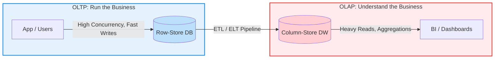

***

# 💻 OLTP vs. OLAP: A Strategic Technical Overview

Understanding the fundamental difference between Online Transactional Processing (OLTP) and Online Analytical Processing (OLAP) is crucial for designing performant and scalable data architectures. Misconceptions often lead to critical system performance degradation.

---

## 1. 📋 Executive Summary

The core distinction lies in their **purpose and query patterns**:

*   **OLTP (Online Transactional Processing):**
    *   **Goal:** To **run** the business.
    *   **Workload:** Billions of small, fast, and precise transactions (e.g., `INSERT`, `UPDATE`, `DELETE`).
    *   **Focus:** **Write-heavy** operations, data integrity, and high concurrency for operational processes.

*   **OLAP (Online Analytical Processing):**
    *   **Goal:** To **understand** the business.
    *   **Workload:** Heavy, complex queries on massive datasets for reporting and analysis.
    *   **Focus:** **Read-heavy** operations, aggregation speed, and historical data analysis.

> [!WARNING]
> **Critical Error:** Running heavy analytical queries (OLAP workload) directly on a live operational database (OLTP) will inevitably lead to performance bottlenecks, blocking, and potential system collapse.

---

## 2. 🏗️ Fundamental Architectural Differences



| Feature                 | OLTP (Operational)                               | OLAP (Analytical)                                   |
| :---------------------- | :----------------------------------------------- | :-------------------------------------------------- |
| **Primary Goal**        | Day-to-day operations (e.g., sales, registrations) | Strategic decision-making (e.g., annual sales trends) |
| **Schema Design**       | Highly Normalized (e.g., 3NF)                   | Denormalized (Star Schema, Snowflake Schema)        |
| **Data Nature**         | Current, real-time data                          | Historical, aggregated, massive datasets (snapshots) |
| **Work Unit**           | Small, atomic transactions (row-based)           | Large batch processes, aggregations (columnar)      |
| **Storage Technology**  | Row-Store (B-Tree indexes)                       | Column-Store (high compression, optimized for scans) |
| **Typical Operations**  | `INSERT`, `UPDATE`, `DELETE`, single-row `SELECT` | `GROUP BY`, `SUM`, `AVG`, `COUNT` over large datasets |
| **Performance Metric**  | Transaction throughput, response time           | Query execution time, data loading speed            |
| **Latency**             | Milliseconds                                     | Seconds to minutes (for complex queries)            |
| **Data Volume**         | Moderate to large                                | Very large (terabytes to petabytes)                 |
| **Concurrency**         | High, many concurrent users/transactions         | Lower, fewer concurrent analytical users            |
| **Data Integrity**      | Strict ACID properties                           | Eventually consistent, focus on data quality for analysis |
| **Example Systems**     | SQL Server, PostgreSQL, MySQL                    | Azure Synapse, Snowflake, Google BigQuery, Redshift |

---

## 3. 📝 Scenario & Code Examples

Let's consider an online retail system.

### a) OLTP Scenario: Processing a Single Order

Here, speed of data entry and preventing conflicts (locking) are critical. The database is highly normalized to prevent data redundancy.

```sql
-- OLTP: Fast record insertion/update
BEGIN TRANSACTION;
-- Check product stock and update
UPDATE Products SET Stock = Stock - 1 WHERE ProductID = 101;
-- Record the new order
INSERT INTO Orders (CustomerID, OrderDate, TotalAmount) 
VALUES (552, GETDATE(), 150.00);
COMMIT;
```
*   **Strategic Analysis:** OLTP systems require efficient indexing on primary keys and frequently updated columns (like `ProductID`) to quickly locate and lock specific rows.

### b) OLAP Scenario: Monthly Sales Report by Category

This query might scan millions of rows. Executing this directly on an OLTP database would cause severe blocking and performance degradation.

```sql
-- OLAP: Analyzing vast amounts of historical data
SELECT 
    p.CategoryName, 
    SUM(f.SalesAmount) AS TotalRevenue,
    COUNT(DISTINCT f.OrderID) AS UniqueOrderCount
FROM FactSales f
JOIN DimProduct p ON f.ProductKey = p.ProductKey
JOIN DimDate d ON f.DateKey = d.DateKey
WHERE d.Year = 2023 AND d.MonthName = 'April'
GROUP BY p.CategoryName
ORDER BY TotalRevenue DESC;
```
*   **Strategic Analysis:** In OLAP, we often utilize **Columnstore Indexes**. This is because for aggregations like `SUM(SalesAmount)`, the engine only needs to read the `SalesAmount` column, ignoring other columns (e.g., customer address) in the same row group. This can lead to orders of magnitude faster query performance on large datasets.

---

## 4. 🚨 Critical Analysis & Common Pitfalls

> [!CAUTION]
> 1. **The Normalization Trap:** While 3NF is excellent for OLTP to prevent data anomalies, it's a performance killer in OLAP. Excessive `JOIN` operations on multi-billion row tables are prohibitively slow. OLAP intentionally denormalizes data for query speed.
> 
> 2. **"Live Reporting" Syndrome:** Business users often demand "real-time" reports. Allowing them direct query access to the OLTP database will cause customer transactions (e.g., purchases) to queue behind heavy analytical reports due to locking and resource contention.
> 
> 3. **Using the Wrong Tool:** Employing a standard relational database (like SQL Server configured for OLTP) for petabytes of analytical data is an architectural mistake. This is where Massively Parallel Processing (MPP) analytical databases (e.g., Azure Synapse, Snowflake) become essential.

---

## 5. 🎯 Prioritized Action Plan

To avoid performance catastrophes and build robust data platforms:

### Step 1: Physical Segregation (Immediate Action)
*   **Isolate analytical workloads immediately.** At a minimum, leverage **Read-Only Replicas** (e.g., via Always On Availability Groups) for reporting queries, offloading them from the primary OLTP database.

### Step 2: Establish an ETL/ELT Pipeline
*   Implement a robust data pipeline (`Extract, Transform, Load` or `Extract, Load, Transform`) to move data from your OLTP source systems, clean it, and load it into a dedicated **Data Warehouse** or **Data Lakehouse** environment.

### Step 3: Optimize Schema Design for Analytics
*   In the analytical environment, adopt a **Star Schema** model:
    *   **Fact Tables:** Store quantitative, granular, and usually high-volume data (e.g., sales transactions).
    *   **Dimension Tables:** Store descriptive attributes (e.g., product details, time, customer information).

### Step 4: Intelligent Indexing Strategy
*   **OLTP:** Use narrow, highly selective indexes (e.g., clustered indexes on primary keys, non-clustered indexes on frequently searched or joined columns).
*   **OLAP:** Maximize the use of **Clustered Columnstore Indexes** for fact tables to achieve superior compression and query performance for analytical queries.

---

> 💡 **Strategic Imperative:** If your operational database is experiencing slowdowns due to reporting queries, you are likely treating an OLTP system as an OLAP system. This path leads to a dead end. Rectify your architecture proactively.

---
*Date (Gregorian):* `2026/04/25`  
*Topic:* `Data Architecture - OLTP vs. OLAP`
