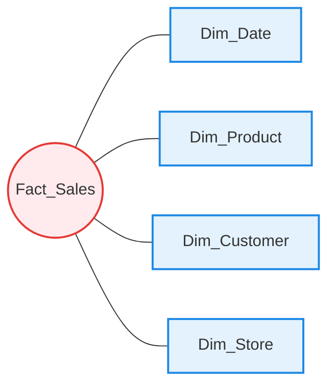
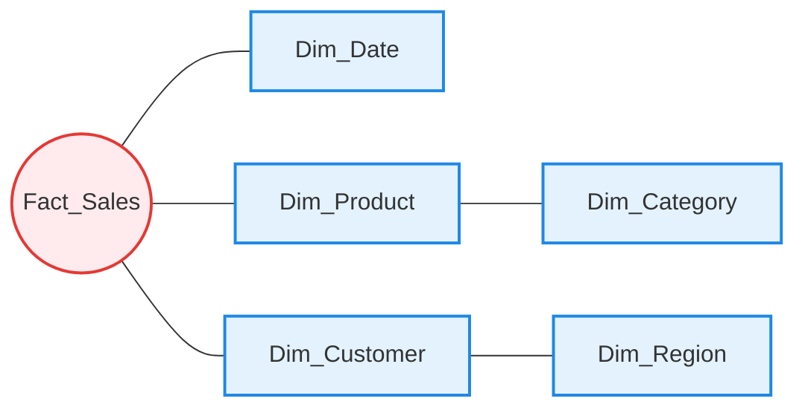
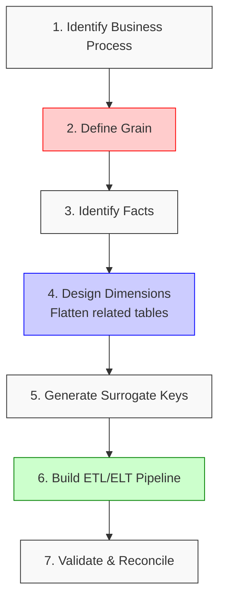

***

# 🌟 Star Schema vs. Snowflake Schema  
**From Zero to Hero — Design, Trade-offs, and OLTP Conversion**

---

## 📋 Executive Summary

> [!NOTE]
> - **Star Schema** and **Snowflake Schema** are **dimensional modeling techniques** used in **OLAP / analytical systems**, *not* OLTP.
> - **Star Schema** prioritizes **query performance and simplicity**.
> - **Snowflake Schema** prioritizes **storage efficiency and normalization**.
> - Converting **OLTP → Dimensional Model** is **not a mechanical task**; it requires **business understanding, grain definition, and controlled denormalization**.

> [!WARNING]
> Most teams **over-normalize**, underestimate **grain definition**, and **design dimensions too late** — these are the primary causes of failure.

---

## 1. 🏗️ Foundations: OLTP vs OLAP (You Must Get This Right)

### OLTP (Online Transaction Processing)
**Purpose:** Run the business  
**Characteristics:**
- Highly normalized (3NF+)
- Many tables
- Frequent inserts/updates
- Small, fast transactions
- *Examples:* Order processing, banking, ERP

### OLAP (Online Analytical Processing)
**Purpose:** Understand the business  
**Characteristics:**
- Denormalized
- Few large tables
- Read-heavy
- Aggregations and scans
- *Examples:* Dashboards, BI, reporting, ML features

> 💡 **Brutal truth:** If you try to run analytics directly on OLTP, you will fail at scale.

---

## 2. 📐 Dimensional Modeling Core Concepts

### 2.1 Fact Tables
- Contain **measurable metrics** (typically numeric).
- Large row counts.
- *Examples:* Sales Amount, Quantity, Revenue, Duration.

### 2.2 Dimension Tables
- Contain **descriptive attributes**.
- Used for filtering, grouping, and labeling.
- *Examples:* Date, Customer, Product, Location.

### 2.3 Grain (Non-Negotiable Concept)
> **Grain = What does one row in the fact table represent?**

*Examples:*
- One row per **order line**
- One row per **daily product sales**
- One row per **user session**

🚨 **If grain is unclear → your model is already broken.**

---

## 3. ⭐ Star Schema (From Zero to Hero)

### 3.1 What Is a Star Schema?
A **central fact table** connected to **denormalized dimension tables**.



### 3.2 Characteristics

| Aspect | Star Schema |
|------|-------------|
| **Normalization** | Low |
| **Joins** | Minimal |
| **Query Speed** | Very fast |
| **Storage** | Higher |
| **Complexity** | Low |
| **BI Tool Friendly** | Excellent |

### 3.3 When to Use Star Schema
- BI dashboards & ad-hoc analysis
- High-performance reporting
- When storage is cheap (almost always)

### 3.4 Advantages & Disadvantages
✅ **Advantages:**
- Simple mental model
- Predictable SQL
- Optimized by most query engines
- Easy for analysts

❌ **Disadvantages:**
- Data redundancy
- Slightly more ETL work
- Less flexible for deep hierarchies

---

## 4. ❄️ Snowflake Schema (From Zero to Hero)

### 4.1 What Is a Snowflake Schema?
A **fact table** connected to **normalized dimension tables** (dimensions have their own sub-dimensions).



### 4.2 Characteristics

| Aspect | Snowflake Schema |
|------|------------------|
| **Normalization** | Higher |
| **Joins** | More |
| **Query Speed** | Slower |
| **Storage** | Lower |
| **Complexity** | Higher |
| **BI Tool Friendly** | Moderate |

### 4.3 When to Use Snowflake Schema
- Very large dimensions
- Storage constraints
- Complex hierarchies
- Strong governance requirements

### 4.4 Advantages & Disadvantages
✅ **Advantages:**
- Reduced redundancy
- Better consistency
- Cleaner hierarchy modeling

❌ **Disadvantages:**
- Slower queries
- More joins
- Harder for analysts
- BI tools struggle more

> 💡 **Hard truth:** Snowflake schema is often chosen for *engineering aesthetics*, not business value.

---

## 5. 🥊 Star vs Snowflake (Decision Table)

| Question | Choose |
|--------|--------|
| Need maximum performance? | **Star** ⭐ |
| Analysts write SQL? | **Star** ⭐ |
| Storage is cheap? | **Star** ⭐ |
| Very complex hierarchies? | **Snowflake** ❄️ |
| Extreme dimension size? | **Snowflake** ❄️ |
| Governance > Speed? | **Snowflake** ❄️ |

🎯 **Default recommendation: Star Schema**

---

## 6. 🔄 Converting OLTP → Star Schema (Step-by-Step)



### Step 1: Identify Business Process
*Examples:* Sales, Shipments, Payments, Website activity.  
🛑 **If the process is unclear, stop.**

### Step 2: Define the Grain (Critical)
*Example:* One row per **order line per day**. Write it down. Lock it. Enforce it.

### Step 3: Identify Facts
From OLTP tables such as `orders`, `order_items`, `transactions`.
*Examples:* `total_amount`, `quantity`, `discount`, `tax`.  
📌 **Rule:** Facts should be additive whenever possible.

### Step 4: Identify Dimensions
From OLTP reference tables: `customers`, `products`, `stores`, `dates`.  
Flatten related tables into **single dimension tables**.
```text
customers
+ customer_addresses
+ customer_segments
→ dim_customer
```

### Step 5: Design Surrogate Keys
- Never use OLTP natural keys.
- Generate integer surrogate keys.
- Maintain key mapping tables.

### Step 6: Build ETL / ELT
1. Extract from OLTP
2. Transform (clean, deduplicate, flatten)
3. Load dimensions first
4. Load facts last

### Step 7: Validate
- Row counts
- Aggregation checks
- Business total reconciliation

---

## 7. 🔄 Converting OLTP → Snowflake Schema

### Key Difference
Dimensions are **not fully flattened**. Steps 1–3 are the same as the Star Schema.

### Step 4: Normalize Dimensions
Instead of:
```text
dim_product (product, category, department)
```
You create:
```text
dim_product
  → dim_category
→ dim_department
```

### Step 5: ETL Complexity Increases
- Load parent dimensions first.
- Enforce referential integrity.
- Expect more joins.

### Step 6: Validate Hierarchies
- No orphan records.
- Correct rollups.
- Consistent keys.

---

## 8. ❌ Common Mistakes

- **Designing Without Grain**  
  *Result:* Wrong numbers, endless rework.
- **Copying OLTP Structure**  
  *Result:* Slow, unusable analytics.
- **Over-Snowflaking**  
  *Result:* Analyst resistance, low adoption.
- **Ignoring Slowly Changing Dimensions (SCD)**  
  *Result:* Incorrect historical analysis.

---

## 9. 🦸 Advanced Topics (Hero Level)

### 9.1 Slowly Changing Dimensions (SCD)
- **Type 1:** Overwrite (no history kept)
- **Type 2:** Full history (add new rows with effective dates)
- **Type 3:** Limited history (add new columns for previous value)

### 9.2 Conformed Dimensions
- Shared dimensions across multiple fact tables.
- Enables cross-domain analysis (e.g., using the same `Dim_Date` for Sales and Marketing fact tables).

### 9.3 Fact Table Types
- **Transactional:** One row per transaction event.
- **Snapshot:** Periodic state (e.g., daily account balances).
- **Accumulating Snapshot:** Tracks a process with defined milestones (e.g., order fulfillment pipeline).

---

## 10. 🎯 Final Recommendation

1. Start with **Star Schema**.
2. Optimize for **business questions**.
3. Use Snowflake only with **proven justification**.

> 💡 **Golden Rule:** If analysts can’t understand the model in 10 minutes, it’s wrong.
