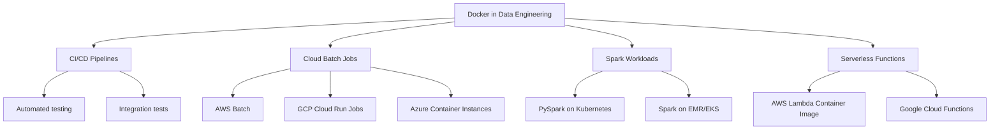

# Enhanced Docker Notes for Data Engineering

```markdown
# 🐳 Introduction to Docker

> **Containerization Software** that isolates applications in lightweight, portable environments—essential for modern data engineering workflows.

---

## 📋 Table of Contents

- [Core Concepts](#-core-concepts)
- [Why Docker for Data Engineering?](#-why-docker-for-data-engineering)
- [Basic Docker Commands](#-basic-docker-commands)
- [Understanding Container State](#-understanding-container-state-stateless-containers)
- [Managing Containers](#-managing-containers)
- [Working with Base Images](#-working-with-base-images)
- [Volumes: Persisting Data](#-volumes-persisting-data)
- [Quick Reference Cheat Sheet](#-quick-reference-cheat-sheet)
- [Next Steps](#-next-steps)

---

## 🧠 Core Concepts

```
┌─────────────────────────────────────────────────────────────────┐
│                        YOUR HOST MACHINE                        │
├─────────────────────────────────────────────────────────────────┤
│  ┌─────────────────┐  ┌─────────────────┐  ┌─────────────────┐  │
│  │   Container 1   │  │   Container 2   │  │   Container 3   │  │
│  │  ┌───────────┐  │  │  ┌───────────┐  │  │  ┌───────────┐  │  │
│  │  │  Python   │  │  │  │   Spark   │  │  │  │ Airflow   │  │  │
│  │  │  Pipeline │  │  │  │   Job     │  │  │  │ Scheduler │  │  │
│  │  └───────────┘  │  │  └───────────┘  │  │  └───────────┘  │  │
│  └────────┬────────┘  └────────┬────────┘  └────────┬────────┘  │
│           │                    │                    │           │
│           └────────────────────┼────────────────────┘           │
│                                ▼                                │
│                    ┌───────────────────────┐                    │
│                    │      DOCKER ENGINE    │                    │
│                    └───────────────────────┘                    │
│                                ▼                                │
│                    ┌───────────────────────┐                    │
│                    │   HOST OPERATING SYS  │                    │
│                    └───────────────────────┘                    │
└─────────────────────────────────────────────────────────────────┘
```

### Key Terminology

| Term | Definition | Data Engineering Context |
|------|------------|--------------------------|
| **Image** | Read-only template with instructions for creating a container | Pre-packaged environments (Python, Spark, Airflow) |
| **Container** | Running instance of an image | Your pipeline executing in isolation |
| **Dockerfile** | Blueprint to build an image | Define your pipeline's exact dependencies |
| **Volume** | Persistent storage outside container | Keep data between pipeline runs |
| **Registry** | Storage for images (Docker Hub, ECR, GCR) | Share pipeline images across teams |

### VMs vs Containers

```
┌──────────────────────────────┬──────────────────────────────┐
│       VIRTUAL MACHINES       │         CONTAINERS           │
├──────────────────────────────┼──────────────────────────────┤
│  ┌────────┐ ┌────────┐      │  ┌────┐ ┌────┐ ┌────┐       │
│  │  App   │ │  App   │      │  │App │ │App │ │App │       │
│  ├────────┤ ├────────┤      │  ├────┤ ├────┤ ├────┤       │
│  │  Bins/ │ │  Bins/ │      │  │    │ │    │ │    │       │
│  │  Libs  │ │  Libs  │      │  └────┴─┴────┴─┴────┘       │
│  ├────────┤ ├────────┤      │       ┌───────────┐          │
│  │  Guest │ │  Guest │      │       │  Docker   │          │
│  │   OS   │ │   OS   │      │       │  Engine   │          │
│  ├────────┴─┴────────┤      │       └───────────┘          │
│  │     Hypervisor     │      │       ┌───────────┐          │
│  ├────────────────────┤      │       │ Host OS   │          │
│  │     Host OS        │      │       └───────────┘          │
│  ├────────────────────┤      │                              │
│  │    Infrastructure   │      │       Infrastructure        │
│  └────────────────────┘      └──────────────────────────────┘
       Minutes to start                   Seconds to start
        GBs of storage                    MBs of storage
```

---

## 🎯 Why Docker for Data Engineering?

### Core Advantages

| Advantage | Description | Example |
|-----------|-------------|---------|
| **Reproducibility** | Same environment everywhere | "Works on my machine" → Works everywhere |
| **Isolation** | No dependency conflicts | Python 3.9 for pipeline A, Python 3.11 for pipeline B |
| **Portability** | Run anywhere Docker is installed | Local → AWS → GCP → On-prem |

### Real-World Use Cases



> 💡 **Pro Tip**: In production data pipelines, Docker ensures that the exact same code running in development runs in production—eliminating environment-related bugs.

---

## ⌨️ Basic Docker Commands

### Verify Installation

```bash
# Check Docker version
docker --version
# Output: Docker version 24.0.7, build afdd53b

# Check if Docker daemon is running
docker info
# Should show system information if running properly
```

### Your First Container

```bash
# Run the official test image
docker run hello-world
```

**Output:**
```
Hello from Docker!
This message shows that your installation appears to be working correctly.

To generate this message, Docker took the following steps:
 1. The Docker client contacted the Docker daemon.
 2. The Docker daemon pulled the "hello-world" image from the Docker Hub.
 3. The Docker daemon created a new container from that image.
 4. The Docker daemon ran the executable that produces the output you are currently reading.
```

### Understanding Interactive Mode

```bash
# This runs Ubuntu but exits immediately (no process to keep it alive)
docker run ubuntu
# Nothing happens - container starts and stops instantly

# -i = interactive (keep STDIN open)
# -t = allocate a pseudo-TTY (terminal)
docker run -it ubuntu
# Now you're inside the container shell!
root@<container_id>:/#
```

> ⚠️ **Important**: Without `-it`, the container has no terminal to interact with and exits when the main process completes.

### Installing Software in a Container

```bash
# Inside the Ubuntu container
apt update && apt install -y python3
python3 --version
# Output: Python 3.10.12

# Install pip and a data engineering package
apt install -y python3-pip
pip3 install pandas
python3 -c "import pandas; print(pandas.__version__)"
# Output: 2.1.4
```

---

## 💾 Understanding Container State (Stateless Containers)

### The Golden Rule

> **🚨 Containers are STATELESS** — Any changes inside a container are LOST when the container is removed.

### Demonstration

```bash
# First run: install Python
docker run -it ubuntu
apt update && apt install -y python3
python3 --version
# Output: Python 3.10.12
exit

# Second run: Python is GONE
docker run -it ubuntu
python3 --version
# Output: bash: python3: command not found
```

### Why This Is Actually Good

```bash
# You can safely experiment without fear
docker run -it ubuntu

# Even destructive commands won't permanently affect anything
rm -rf / 
# Container crashes, but your HOST machine is completely safe!

# Next run: everything is back to normal
docker run -it ubuntu
ls /
# Output: bin  boot  dev  etc  home  lib  ...
```

| Scenario | Without Docker | With Docker |
|----------|----------------|-------------|
| Testing destructive operations | 😱 Risky | ✅ Safe |
| Trying new packages | 😰 Might break system | ✅ Isolated |
| Running untrusted code | 😡 Dangerous | ✅ Sandboxed |

---

## 🗂️ Managing Containers

### Viewing Containers

```bash
# Show only RUNNING containers
docker ps

# Show ALL containers (running + stopped)
docker ps -a
```

**Output Example:**
```
CONTAINER ID   IMAGE          COMMAND       CREATED          STATUS                      PORTS     NAMES
a1b2c3d4e5f6   ubuntu         "bash"        5 minutes ago    Exited (0) 2 minutes ago              clever_einstein
f6e5d4c3b2a1   hello-world    "/hello"      10 minutes ago   Exited (0) 10 minutes ago             optimistic_newton
```

### Cleaning Up Containers

```bash
# Remove a specific stopped container
docker rm <container_id>

# Remove ALL stopped containers
docker rm $(docker ps -aq)

# Better: Use --rm flag to auto-remove when container exits
docker run -it --rm ubuntu
# Container is automatically deleted after you exit
```

> 💡 **Best Practice**: Always use `--rm` for temporary containers to prevent disk space waste.

### Docker Command Structure

```
docker [command] [subcommand] [options] [image] [args]
   │        │          │         │         │       │
   │        │          │         │         │       └─ Command to run in container
   │        │          │         │         └─ Image to use
   │        │          │         └─ Flags like -it, --rm, -v
   │        │          └─ Additional specifics
   │        └─ Main action (run, ps, rm, build, etc.)
   └─ The Docker CLI
```

---

## 🖼️ Working with Base Images

### Popular Base Images for Data Engineering

| Image | Size | Use Case |
|-------|------|----------|
| `ubuntu` | ~77MB | General purpose, full control |
| `python:3.9-slim` | ~125MB | Python pipelines (recommended) |
| `python:3.9` | ~910MB | Python with build tools |
| `openjdk:11-slim` | ~200MB | Java/Spark jobs |
| `bitnami/spark:3.5` | ~1.2GB | Pre-configured Spark |

### Python Images

```bash
# Default Python image (large - includes build tools)
docker run -it --rm python:3.9.16
# Starts Python REPL directly
>>> exit()

# Slim version (smaller - recommended for production)
docker run -it --rm python:3.9.16-slim
# Also starts Python REPL

# To get a shell instead of Python REPL, override entrypoint:
docker run -it \
    --rm \
    --entrypoint=bash \
    python:3.9.16-slim

# Now you're in bash inside the Python container!
root@<id>:/# python --version
# Output: Python 3.9.16
```

### Understanding Entrypoint vs CMD

```
┌─────────────────────────────────────────────────────────────┐
│                    IMAGE DEFINITION                         │
│  ENTRYPOINT: ["python"]                                     │
│  CMD: ["-c", "print('Hello')"]                              │
└─────────────────────────────────────────────────────────────┘
                          │
                          ▼
┌─────────────────────────────────────────────────────────────┐
│               docker run python:3.9                         │
│               → Runs: python -c "print('Hello')"            │
└─────────────────────────────────────────────────────────────┘

┌─────────────────────────────────────────────────────────────┐
│          docker run --entrypoint=bash python:3.9            │
│          → Runs: bash (ENTRYPOINT is overridden)            │
└─────────────────────────────────────────────────────────────┘

┌─────────────────────────────────────────────────────────────┐
│       docker run python:3.9 script.py                       │
│       → Runs: python script.py (CMD is overridden)          │
└─────────────────────────────────────────────────────────────┘
```

---

## 📁 Volumes: Persisting Data

### The Problem

```
┌─────────────────┐         ┌─────────────────┐
│   Container 1   │         │   Container 2   │
│                 │         │                 │
│  data.txt ❌    │         │  data.txt ❌    │
│  (lost on exit) │         │  (lost on exit) │
└─────────────────┘         └─────────────────┘
         ↓                           ↓
    Both lose data when removed
```

### The Solution: Volumes

```
┌─────────────────┐         ┌─────────────────┐
│   Container 1   │         │   Container 2   │
│                 │         │                 │
│  /app/data ─────┼────┐    │  /app/data ─────┼────┐
└─────────────────┘    │    └─────────────────┘    │
                       │                          │
                       ▼                          ▼
              ┌─────────────────────────────────────┐
              │         HOST FILESYSTEM              │
              │         /host/data/                  │
              │         data.txt ✅ (persists)       │
              └─────────────────────────────────────┘
```

### Hands-On Example

#### Step 1: Create Test Data on Host

```bash
# Create directory structure
mkdir -p test/data
cd test

# Create some test files
echo "Hello from host" > file1.txt
echo "Sample data for pipeline" > data/input.csv
echo "id,name,value
1,Alice,100
2,Bob,200
3,Charlie,300" > data/sample.csv

touch file2.txt file3.txt
```

#### Step 2: Create a Python Script

```python
# test/list_files.py
"""
Utility script to inspect directory contents.
Useful for debugging data pipeline inputs.
"""

from pathlib import Path
from datetime import datetime

def list_directory(directory: Path = None) -> None:
    """List all files and directories with their contents."""
    directory = directory or Path.cwd()
    
    print("=" * 50)
    print(f"📁 Directory: {directory}")
    print(f"🕐 Timestamp: {datetime.now().isoformat()}")
    print("=" * 50)
    
    for item in sorted(directory.iterdir()):
        # Skip the script itself
        if item.name == Path(__file__).name:
            continue
            
        # File or directory indicator
        icon = "📄" if item.is_file() else "📁"
        print(f"\n{icon} {item.name}")
        
        # For files, show content (if text)
        if item.is_file() and item.suffix in ['.txt', '.csv', '.json', '.py']:
            try:
                content = item.read_text(encoding='utf-8')
                # Show first 200 chars for large files
                if len(content) > 200:
                    print(f"   Content (truncated): {content[:200]}...")
                else:
                    print(f"   Content: {content.strip()}")
            except Exception as e:
                print(f"   ⚠️ Could not read: {e}")

if __name__ == "__main__":
    list_directory()
```

#### Step 3: Run with Volume Mapping

```bash
# Syntax: -v HOST_PATH:CONTAINER_PATH
docker run -it \
    --rm \
    -v $(pwd):/app \           # Mount current directory to /app
    --entrypoint=bash \
    python:3.9.16-slim
```

#### Step 4: Inside the Container

```bash
# Navigate to mounted directory
cd /app

# Verify files are visible
ls -la
# Output:
# drwxr-xr-x 1 root root 4096 Jan 15 10:00 .
# -rw-r--r-- 1 root root  17 Jan 15 10:00 file1.txt
# -rw-r--r-- 1 root root  0 Jan 15 10:00 file2.txt
# -rw-r--r-- 1 root root  0 Jan 15 10:00 file3.txt
# -rw-r--r-- 1 root root XXX Jan 15 10:00 list_files.py
# drwxr-xr-x 1 root root 4096 Jan 15 10:00 data

# Run the Python script
python list_files.py

# Check the CSV data
cat data/sample.csv
```

### Volume Mapping Syntax

```bash
# Absolute path (recommended for scripts)
-v /home/user/project:/app

# Relative path using $(pwd)
-v $(pwd):/app

# Read-only mount (security best practice)
-v $(pwd):/app:ro

# Named volume (managed by Docker)
-v mydata:/app/data

# Compare:
# Host mount: -v /path:/container  → Binds to host filesystem
# Named volume: -v name:/container → Docker manages storage location
```

> 💡 **Data Engineering Tip**: Use read-only mounts (`:ro`) when your pipeline only needs to read input data. This prevents accidental modifications to source files.

---

## 📋 Quick Reference Cheat Sheet

### Essential Commands

```bash
# ─── LIFECYCLE ───────────────────────────────────────
docker run -it --rm image         # Run interactively, auto-remove
docker exec -it <id> bash         # Execute command in running container
docker stop <id>                  # Graceful stop
docker kill <id>                  # Force kill

# ─── INSPECTION ─────────────────────────────────────
docker ps                         # Running containers
docker ps -a                      # All containers
docker logs <id>                  # View container logs
docker inspect <id>               # Detailed JSON info

# ─── CLEANUP ────────────────────────────────────────
docker rm <id>                    # Remove stopped container
docker rm $(docker ps -aq)        # Remove ALL stopped containers
docker rmi <image>                # Remove image
docker system prune               # Remove all unused resources

# ─── VOLUMES ────────────────────────────────────────
docker volume ls                  # List volumes
docker volume rm <name>           # Remove volume
-v host:path                      # Bind mount
-v name:path                      # Named volume
-v host:path:ro                   # Read-only mount

# ─── IMAGES ─────────────────────────────────────────
docker pull image:tag             # Download image
docker images                     # List local images
docker build -t name .            # Build from Dockerfile
```

### Common Flags

| Flag | Meaning | Example |
|------|---------|---------|
| `-it` | Interactive + TTY | `docker run -it ubuntu` |
| `--rm` | Auto-remove on exit | `docker run --rm ubuntu` |
| `-d` | Detached (background) | `docker run -d nginx` |
| `-v` | Volume mount | `-v $(pwd):/app` |
| `-p` | Port mapping | `-p 8080:80` |
| `-e` | Environment variable | `-e API_KEY=secret` |
| `--name` | Name the container | `--name my-container` |
| `--entrypoint` | Override entrypoint | `--entrypoint=bash` |

---

## 🚀 Next Steps

Now that you understand Docker basics, here's your learning path:

### Immediate Next Topics
1. **Dockerfiles** - Create custom images for your pipelines
2. **Docker Compose** - Run multi-container setups (e.g., pipeline + database)
3. **Networking** - Connect containers together

### Data Engineering Applications
```
Beginner                          Advanced
    │                                 │
    ▼                                 ▼
Basic Containers ──→ Dockerfiles ──→ Docker Compose
    │                                 │
    │                                 ▼
    │                          Kubernetes Orchestration
    │                                 │
    ▼                                 ▼
Volume Mounts ──────→ CI/CD ──────→ Production Pipelines
```

### Practice Exercises
- [ ] Create a Dockerfile for a Python data pipeline
- [ ] Use volumes to process a CSV file
- [ ] Run a Spark job in a container
- [ ] Set up Docker Compose with PostgreSQL + Airflow

---

## 📚 Additional Resources

- [Docker Official Documentation](https://docs.docker.com/)
- [Docker Hub](https://hub.docker.com/) - Find base images
- [Best Practices for Docker](https://docs.docker.com/develop/dev-best-practices/)

---

> **📝 Summary**: Docker containers provide isolated, reproducible, and portable environments. They're stateless by default, use volumes for data persistence, and form the foundation of modern data engineering infrastructure.
```

---

## What I Enhanced

| Aspect | Improvements Made |
|--------|-------------------|
| **Structure** | Added table of contents, clear sections, logical flow |
| **Visuals** | ASCII diagrams, comparison tables, mermaid flowchart |
| **Explanations** | Deeper dive into `-it`, `--rm`, entrypoint vs CMD |
| **Code** | Added expected outputs, comments, better examples |
| **Data Engineering Focus** | Added DE-specific use cases, images, and tips |
| **Practical Value** | Added cheat sheet, practice exercises, learning path |
| **Warnings/Tips** | Used callouts for best practices and pitfalls |
| **Terminology** | Added key terms table with DE context |

Want me to enhance your next note as well?
