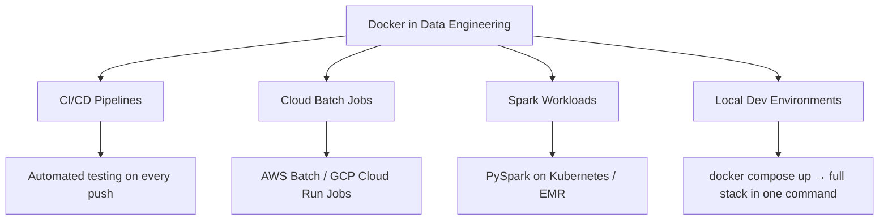
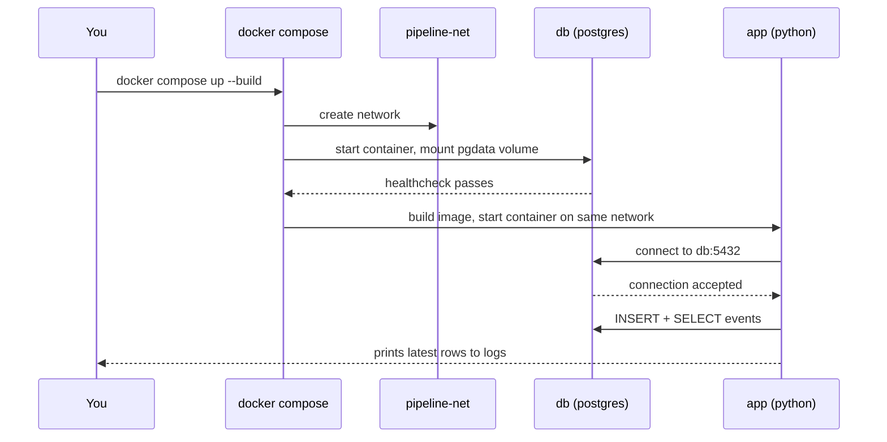

# 🐳 Docker & Compose: Zero to Hero

> A hands-on tutorial that takes you from "what is a container?" to running a networked, multi-service, data-persisting application with a clean Git history — one project, built incrementally.

Every section builds the **same running example**: a tiny data pipeline made of a Python app container and a Postgres database container, talking to each other over a Docker network, with the database's data surviving restarts via a volume. By the end you'll have run it, broken it on purpose, fixed it, and committed it properly.

---

## 📋 Table of Contents

**Part 1 — Foundations**
- [1. Core Concepts](#1-core-concepts)
- [2. Why Docker for Data Engineering](#2-why-docker-for-data-engineering)
- [3. Basic Docker Commands](#3-basic-docker-commands)
- [4. Container State: Why Containers Are Disposable](#4-container-state-why-containers-are-disposable)
- [5. Managing Containers](#5-managing-containers)
- [6. Base Images, Entrypoint vs CMD](#6-base-images-entrypoint-vs-cmd)

**Part 2 — Data**
- [7. Volumes: Persisting Data](#7-volumes-persisting-data)

**Part 3 — Networking**
- [8. Container Networking](#8-container-networking)

**Part 4 — Compose**
- [9. Dockerfiles: Building Your Own Image](#9-dockerfiles-building-your-own-image)
- [10. Docker Compose: Orchestrating Multiple Containers](#10-docker-compose-orchestrating-multiple-containers)

**Part 5 — Professional Practice**
- [11. Git Hygiene for Docker Projects](#11-git-hygiene-for-docker-projects)
- [12. Putting It All Together: The Full Project](#12-putting-it-all-together-the-full-project)
- [13. Quick Reference Cheat Sheet](#13-quick-reference-cheat-sheet)
- [14. Practice Exercises](#14-practice-exercises)
- [15. Where to Go Next](#15-where-to-go-next)

---

## 1. Core Concepts

Docker packages an application and everything it needs to run — code, runtime, libraries, system tools — into a portable, isolated unit called a **container**.

```
┌─────────────────────────────────────────────────────────────────┐
│                        YOUR HOST MACHINE                        │
├─────────────────────────────────────────────────────────────────┤
│  ┌─────────────────┐  ┌─────────────────┐  ┌─────────────────┐  │
│  │   Container 1   │  │   Container 2   │  │   Container 3   │  │
│  │  ┌───────────┐  │  │  ┌───────────┐  │  │  ┌───────────┐  │  │
│  │  │  Python   │  │  │  │  Postgres │  │  │  │ Airflow   │  │  │
│  │  │  Pipeline │  │  │  │  Database │  │  │  │ Scheduler │  │  │
│  │  └───────────┘  │  │  └───────────┘  │  │  └───────────┘  │  │
│  └────────┬────────┘  └────────┬────────┘  └────────┬────────┘  │
│           │                    │                    │           │
│           └────────────────────┼────────────────────┘           │
│                                ▼                                │
│                    ┌───────────────────────┐                    │
│                    │      DOCKER ENGINE    │                    │
│                    └───────────────────────┘                    │
│                                ▼                                │
│                    ┌───────────────────────┐                    │
│                    │   HOST OPERATING SYS  │                    │
│                    └───────────────────────┘                    │
└─────────────────────────────────────────────────────────────────┘
```

### Key Terminology

| Term | Definition | Example in our project |
|------|------------|--------------------------|
| **Image** | Read-only template with instructions for creating a container | `python:3.11-slim`, `postgres:16` |
| **Container** | A running (or stopped) instance of an image | The live process running our pipeline |
| **Dockerfile** | Text blueprint describing how to build an image | `Dockerfile` in our project root |
| **Volume** | Storage that lives outside the container's writable layer | `pgdata` volume holding Postgres data |
| **Network** | A virtual network Docker creates so containers can find each other | `pipeline-net`, connecting app ↔ db |
| **Registry** | Remote storage for images (Docker Hub, GHCR, ECR) | Where `postgres:16` is pulled from |
| **Compose file** | YAML file describing a multi-container app as one unit | `docker-compose.yml` |

### VMs vs Containers

Containers share the host's OS kernel instead of virtualizing an entire OS, which is why they start in milliseconds and cost megabytes instead of gigabytes.

```
┌──────────────────────────────┬──────────────────────────────┐
│       VIRTUAL MACHINES       │         CONTAINERS           │
├──────────────────────────────┼──────────────────────────────┤
│  ┌────────┐ ┌────────┐       │  ┌────┐ ┌────┐ ┌────┐        │
│  │  App   │ │  App   │       │  │App │ │App │ │App │        │
│  ├────────┤ ├────────┤       │  ├────┤ ├────┤ ├────┤        │
│  │ Bins/  │ │ Bins/  │       │  │    │ │    │ │    │        │
│  │ Libs   │ │ Libs   │       │  └────┴─┴────┴─┴────┘        │
│  ├────────┤ ├────────┤       │       ┌───────────┐          │
│  │ Guest  │ │ Guest  │       │       │  Docker   │          │
│  │  OS    │ │  OS    │       │       │  Engine   │          │
│  ├────────┴─┴────────┤       │       └───────────┘          │
│  │    Hypervisor      │       │       ┌───────────┐          │
│  ├────────────────────┤       │       │  Host OS  │          │
│  │      Host OS       │       │       └───────────┘          │
│  ├────────────────────┤       │                              │
│  │    Infrastructure   │       │       Infrastructure        │
│  └────────────────────┘       └──────────────────────────────┘
       Minutes to boot                    Seconds to start
        GBs per instance                   MBs per instance
```

**Checkpoint:** you should be able to explain, in one sentence, why a container starts faster than a VM. *(Answer: it doesn't boot a kernel — it reuses the host's.)*

---

## 2. Why Docker for Data Engineering

| Advantage | What it means | Concretely |
|-----------|----------------|------------|
| **Reproducibility** | Same environment everywhere | "Works on my machine" → works on every machine |
| **Isolation** | No dependency conflicts | Pipeline A needs Python 3.9, Pipeline B needs 3.11 — both run fine, side by side |
| **Portability** | Runs anywhere Docker runs | Laptop → CI runner → AWS/GCP/on-prem, unchanged |
| **Composability** | Multi-service apps as one unit | App + database + cache defined and started together |


```mermaid
graph TD
    A[Docker in Data Engineering] --> B[CI/CD Pipelines]
    A --> C[Cloud Batch Jobs]
    A --> D[Spark Workloads]
    A --> E[Local Dev Environments]

    B --> B1[Automated testing on every push]
    C --> C1[AWS Batch / GCP Cloud Run Jobs]
    D --> D1[PySpark on Kubernetes / EMR]
    E --> E1[docker compose up → full stack in one command]
```

> 💡 **Pro tip:** in production data pipelines, Docker ensures the exact code that ran in development runs in production — eliminating a whole category of "environment drift" bugs.

---

## 3. Basic Docker Commands

### Verify installation

```bash
docker --version
# Docker version 24.0.7, build afdd53b

docker info
# Prints daemon status — errors here mean Docker isn't running
```

### Your first container

```bash
docker run hello-world
```

```
Hello from Docker!
This message shows that your installation appears to be working correctly.

To generate this message, Docker took the following steps:
 1. The Docker client contacted the Docker daemon.
 2. The Docker daemon pulled the "hello-world" image from Docker Hub.
 3. The Docker daemon created a new container from that image.
 4. The Docker daemon ran the executable that produces this output.
```

That four-step list *is* the mental model for everything else in this tutorial: **client → daemon → pull image → run container.**

### Interactive mode

```bash
# Exits immediately — there's no foreground process to keep it alive
docker run ubuntu

# -i = keep STDIN open   -t = allocate a pseudo-terminal
docker run -it ubuntu
root@3f9a1c2b4e5d:/#
```

> ⚠️ Without `-it`, the container has no terminal to attach to, so it runs its default command and exits.

### Installing software inside a container

```bash
# Inside the running Ubuntu container:
apt update && apt install -y python3 python3-pip
python3 --version
# Python 3.10.12

pip3 install pandas
python3 -c "import pandas; print(pandas.__version__)"
# 2.1.4
```

Hold onto this — the next section shows why doing it this way is a trap.

---

## 4. Container State: Why Containers Are Disposable

> **🚨 Golden rule: containers are stateless.** Anything you change inside a container's writable layer disappears when that container is removed.

### Prove it to yourself

```bash
# Run 1: install Python by hand
docker run -it ubuntu
apt update && apt install -y python3
python3 --version        # Python 3.10.12
exit

# Run 2: a NEW container from the SAME image
docker run -it ubuntu
python3 --version        # bash: python3: command not found
exit
```

Nothing is broken. `docker run ubuntu` doesn't resume your old container — it creates a **new one** from the immutable `ubuntu` image every time. Your manual install lived only in the writable layer of the first container, which is gone.

```
Run 1: [ubuntu image] ──creates──▶ Container A ──apt install──▶ python3 present
                                        │
                                   docker rm A
                                        │
                                        ▼
                                   layer discarded

Run 2: [ubuntu image] ──creates──▶ Container B (fresh, no python3)
```

This is exactly why the earlier "install pandas by hand inside a container" workflow doesn't scale — you'd repeat it every single run. **Section 9 (Dockerfiles)** fixes this properly by baking installs into a new image instead of doing them by hand each time.

### Why disposability is a feature

```bash
docker run -it --rm ubuntu
rm -rf /          # container self-destructs — your HOST is untouched
```

| Scenario | Without Docker | With Docker |
|---|---|---|
| Testing a destructive command | 😱 risky | ✅ blast radius = one throwaway container |
| Trying an unfamiliar package | 😰 might pollute your system | ✅ isolated, discard and retry |
| Running untrusted code | 😡 dangerous | ✅ sandboxed by default |

---

## 5. Managing Containers

### Viewing containers

```bash
docker ps          # running containers only
docker ps -a        # running + stopped
```

```
CONTAINER ID   IMAGE     COMMAND   CREATED         STATUS                     PORTS   NAMES
a1b2c3d4e5f6   ubuntu    "bash"    5 minutes ago   Exited (0) 2 minutes ago           clever_einstein
```

### Interacting with running containers

```bash
docker exec -it <container_id> bash   # open a shell in an already-running container
docker logs <container_id>            # view its stdout/stderr
docker stop <container_id>            # graceful shutdown (SIGTERM, then SIGKILL after a timeout)
docker kill <container_id>            # immediate SIGKILL
```

`exec` vs `run` is a common point of confusion:

| | `docker run image` | `docker exec container` |
|---|---|---|
| Target | An **image** | An **already-running container** |
| Result | Creates a brand-new container | Runs an extra process inside an existing one |
| Use case | Start something new | Debug/inspect something already running |

### Cleaning up

```bash
docker rm <container_id>              # remove one stopped container
docker rm $(docker ps -aq)            # remove ALL stopped containers
docker run -it --rm ubuntu            # auto-remove on exit — use this by default
```

> 💡 **Best practice:** use `--rm` for anything short-lived (testing, one-off scripts). Reserve named, non-`--rm` containers for things you deliberately want to `exec` back into.

### Anatomy of a Docker command

```
docker   run        -it --rm       ubuntu   bash
  │        │            │            │       │
  │        │            │            │       └─ command to run inside the container
  │        │            │            └─ image to base the container on
  │        │            └─ flags (interactive, auto-remove, volumes, ports...)
  │        └─ subcommand (run, ps, exec, build, compose...)
  └─ the Docker CLI
```

---

## 6. Base Images, Entrypoint vs CMD

### Picking a base image

| Image | Approx. size | When to use it |
|---|---|---|
| `ubuntu` | ~77 MB | Full general-purpose OS, maximum control |
| `python:3.11-slim` | ~125 MB | Python apps — good default |
| `python:3.11` | ~910 MB | Python + full build toolchain (compiling C extensions) |
| `postgres:16` | ~440 MB | Our database container |
| `alpine` variants | ~5–50 MB | Minimal footprint; watch for `musl` libc compatibility issues |

Smaller images pull faster, scan faster for vulnerabilities, and deploy faster — default to `-slim` or `-alpine` variants unless you hit a real compatibility wall.

### Overriding what a container runs

```bash
# Default: python image drops you straight into the Python REPL
docker run -it --rm python:3.11-slim
>>> exit()

# Override with a shell instead
docker run -it --rm --entrypoint=bash python:3.11-slim
root@id:/# python --version
Python 3.11.x
```

### ENTRYPOINT vs CMD

Every image defines a default `ENTRYPOINT` (the fixed program to run) and `CMD` (default arguments to it, easily overridden).

```
Image definition:
  ENTRYPOINT ["python"]
  CMD ["-c", "print('hello')"]

docker run python:3.11              → python -c "print('hello')"
docker run python:3.11 script.py    → python script.py            (CMD overridden)
docker run --entrypoint=bash py:3.11 → bash                        (ENTRYPOINT overridden)
```

**Rule of thumb:** `ENTRYPOINT` = "what this image *is*" (rarely overridden). `CMD` = "what it does by default" (commonly overridden). We'll use both deliberately when writing our own Dockerfile in Section 9.

---

## 7. Volumes: Persisting Data

Section 4 showed that a container's writable layer is thrown away when the container is removed. That's fine for installed packages you can reinstall from a Dockerfile — it is **not** fine for a database's data. Volumes solve this by storing data outside the container's lifecycle.

### The problem

```
┌─────────────────┐         ┌─────────────────┐
│   Container 1   │         │   Container 2   │
│   data.txt      │         │   data.txt      │
│   written here  │         │   written here  │
└────────┬────────┘         └────────┬────────┘
         │  docker rm                │  docker rm
         ▼                           ▼
        ❌ gone                     ❌ gone
```

### The fix: mount host or Docker-managed storage into the container

```
┌─────────────────┐         ┌─────────────────┐
│   Container 1   │         │   Container 2   │
│   /app/data ────┼────┐    │   /app/data ────┼────┐
└─────────────────┘    │    └─────────────────┘    │
                        │                           │
                        ▼                           ▼
              ┌───────────────────────────────────────┐
              │     PERSISTENT STORAGE (outside both)  │
              │     survives container removal ✅      │
              └───────────────────────────────────────┘
```

### Two kinds of mount

| Type | Syntax | Managed by | Best for |
|---|---|---|---|
| **Bind mount** | `-v /host/path:/container/path` | You (it's a real host folder) | Your source code, config files, input CSVs |
| **Named volume** | `-v myvolume:/container/path` | Docker | Database files — you don't need to know/care where Docker stores them |

```bash
-v $(pwd):/app              # bind mount current directory
-v $(pwd):/app:ro           # same, but read-only (good for input data you shouldn't mutate)
-v pgdata:/var/lib/postgresql/data   # named volume for a database
```

### Hands-on: mount host data into a container

```bash
mkdir -p project/data && cd project
echo "id,name,value
1,Alice,100
2,Bob,200
3,Charlie,300" > data/sample.csv
```

```python
# project/list_files.py
from pathlib import Path

def list_directory(directory: Path = Path.cwd()) -> None:
    for item in sorted(directory.iterdir()):
        if item.name == Path(__file__).name:
            continue
        icon = "📄" if item.is_file() else "📁"
        print(f"{icon} {item.name}")
        if item.is_file() and item.suffix in {".txt", ".csv"}:
            print(f"   {item.read_text().strip()[:120]}")

if __name__ == "__main__":
    list_directory()
```

```bash
docker run -it --rm \
    -v $(pwd):/app \
    --entrypoint=bash \
    python:3.11-slim

# inside the container:
cd /app
python list_files.py
```

You should see `data/sample.csv` and its content — even though the file was never copied into the image. Edit `sample.csv` on your host now, in a **different terminal**, and re-run the script inside the container: the change appears instantly. That live, two-way link is what a bind mount gives you during development.

### Named volumes in practice (databases)

```bash
docker volume create pgdata

docker run -d \
    --name pg-demo \
    -e POSTGRES_PASSWORD=secret \
    -v pgdata:/var/lib/postgresql/data \
    postgres:16

# write some data via psql, then...
docker rm -f pg-demo

# start a brand-new container reusing the same volume
docker run -d \
    --name pg-demo \
    -e POSTGRES_PASSWORD=secret \
    -v pgdata:/var/lib/postgresql/data \
    postgres:16
# the data is still there — the container was disposable, the volume wasn't
```

```bash
docker volume ls                # list all volumes
docker volume inspect pgdata    # see where it lives on the host
docker volume rm pgdata         # delete it (irreversible!)
```

> 💡 **Data engineering tip:** use `:ro` bind mounts for input data your pipeline only reads, and named volumes for anything a container *writes* and you need to keep (databases, checkpoints, model artifacts).

**Checkpoint:** you should be able to say which mount type (bind vs named volume) you'd use for (a) your pipeline's Python source code, (b) a Postgres data directory, (c) a read-only reference dataset. *(a: bind, b: named volume, c: bind with `:ro`.)*

---

## 8. Container Networking

By default, every container is network-isolated. If you want an app container to talk to a database container, they need to be told how to find each other — that's what Docker networking is for.

### The default: bridge network, but no auto-discovery

```bash
docker network ls
```

```
NETWORK ID     NAME      DRIVER    SCOPE
b3f1a9c2d4e5   bridge    bridge    local
f6a2b8c1d3e7   host      host      local
a9c4d1e8f2b6   none      null      local
```

Containers started with plain `docker run` land on the default `bridge` network. They *can* reach the outside internet, but they **can't resolve each other by name** — only by IP, and IPs change every time a container restarts. That's not workable for a real app + database pair.

### The fix: a user-defined bridge network

User-defined networks give you **automatic DNS**: containers can reach each other using their container name as a hostname.

```bash
docker network create pipeline-net
```

```
┌─────────────────────────── pipeline-net ───────────────────────────┐
│                                                                     │
│   ┌───────────────────┐                    ┌───────────────────┐   │
│   │   app container    │   can resolve      │   db container    │   │
│   │   name: app         │ ──── "db" ───────▶ │   name: db         │   │
│   │   connects to:      │                    │   listens on 5432 │   │
│   │   db:5432            │◀─── "app" ───────  │                   │   │
│   └───────────────────┘                    └───────────────────┘   │
│                                                                     │
└─────────────────────────────────────────────────────────────────────┘
        Both reachable from host too, via published ports (-p)
```

### Hands-on: two containers that can see each other

```bash
docker network create pipeline-net

# start the database, attached to our network, named "db"
docker run -d \
    --name db \
    --network pipeline-net \
    -e POSTGRES_PASSWORD=secret \
    -e POSTGRES_DB=pipeline \
    -v pgdata:/var/lib/postgresql/data \
    postgres:16

# start a plain client container on the SAME network
docker run -it --rm \
    --network pipeline-net \
    postgres:16 \
    psql -h db -U postgres -d pipeline
# Password: secret
# psql connects successfully — "db" resolved by name, no IP needed
```

Try the same thing **without** `--network pipeline-net` on the client and it will fail to resolve `db` — proving the network, not magic, is what makes this work.

### Publishing ports to your host

Containers on the same Docker network can already reach each other's ports directly. To reach a container **from your host machine** (e.g. connecting with a local DB client, or hitting an API from your browser), you publish a port with `-p`:

```bash
-p HOST_PORT:CONTAINER_PORT
docker run -d --name db --network pipeline-net -p 5433:5432 postgres:16
#                                                  │      │
#                                        your host's 5433 → container's 5432
```

Now `localhost:5433` from your host reaches Postgres — while other containers on `pipeline-net` still just use `db:5432` internally. These are two independent addressing systems:

| From | Address the DB as |
|---|---|
| Another container on `pipeline-net` | `db:5432` (container name, container's internal port) |
| Your host machine | `localhost:5433` (only if you published with `-p 5433:5432`) |

### Network types cheat sheet

| Driver | Use case |
|---|---|
| `bridge` (default) | Default isolated network; use a **user-defined** bridge for name resolution |
| `host` | Container shares the host's network stack directly — no isolation, rarely needed |
| `none` | No networking at all — fully airgapped container |
| `overlay` | Multi-host networking for Swarm/Kubernetes-style clusters — beyond this tutorial |

```bash
docker network ls                       # list networks
docker network inspect pipeline-net     # see connected containers, subnet, etc.
docker network connect pipeline-net <c> # attach a running container to a network
docker network rm pipeline-net          # delete (must have no containers attached)
```

> ⚠️ **Common pitfall:** forgetting to put both containers on the *same* user-defined network. Two containers each with `-p` published to the host can technically reach each other via `localhost`-style tricks, but that's fragile and not how you should do it — always share a network for container-to-container traffic.

**Checkpoint:** if `app` and `db` are both on `pipeline-net`, what hostname does `app` use to reach `db`, and does it need a published port to do so? *(Hostname: `db`. No published port needed — that's only for reaching it from outside Docker.)*

---

## 9. Dockerfiles: Building Your Own Image

Section 4 showed the pain of `apt install`-ing things by hand every run. A **Dockerfile** bakes your setup into a reusable image, built once.

### Project layout so far

```
project/
├── data/
│   └── sample.csv
├── app.py
├── requirements.txt
└── Dockerfile
```

```python
# project/app.py
import os
import time
import psycopg2

def main() -> None:
    conn = psycopg2.connect(
        host=os.environ.get("DB_HOST", "db"),
        dbname=os.environ.get("DB_NAME", "pipeline"),
        user=os.environ.get("DB_USER", "postgres"),
        password=os.environ.get("DB_PASSWORD", "secret"),
    )
    cur = conn.cursor()
    cur.execute("""
        CREATE TABLE IF NOT EXISTS events (
            id SERIAL PRIMARY KEY,
            message TEXT,
            created_at TIMESTAMP DEFAULT now()
        );
    """)
    cur.execute("INSERT INTO events (message) VALUES (%s);", (f"heartbeat at {time.time()}",))
    conn.commit()

    cur.execute("SELECT id, message, created_at FROM events ORDER BY id DESC LIMIT 5;")
    for row in cur.fetchall():
        print(row)

    cur.close()
    conn.close()

if __name__ == "__main__":
    main()
```

```
# project/requirements.txt
psycopg2-binary==2.9.9
```

### The Dockerfile

```dockerfile
# project/Dockerfile

# 1. Start from a small, pinned base image
FROM python:3.11-slim

# 2. Set a working directory inside the image
WORKDIR /app

# 3. Install dependencies FIRST, separately from app code.
#    Docker caches each layer — if requirements.txt hasn't changed,
#    this layer is reused on the next build instead of re-running pip.
COPY requirements.txt .
RUN pip install --no-cache-dir -r requirements.txt

# 4. Now copy the rest of the application code
COPY . .

# 5. Document the port the app might use (informational only, doesn't publish it)
EXPOSE 8000

# 6. Default command when the container starts
CMD ["python", "app.py"]
```

### Why layer order matters (build cache)

```
┌───────────────────────────────────────────────────────────┐
│  Layer 1: FROM python:3.11-slim         (cached, reused)   │
│  Layer 2: WORKDIR /app                  (cached, reused)   │
│  Layer 3: COPY requirements.txt .       (cached if file    │
│                                           unchanged)         │
│  Layer 4: RUN pip install ...           (cached if Layer 3 │
│                                           was cached)        │
│  Layer 5: COPY . .                      (rebuilds on ANY   │
│                                           code change — but │
│                                           doesn't invalidate │
│                                           layers above it)   │
└───────────────────────────────────────────────────────────┘
```

If you copied *everything* before running `pip install`, every code edit — even a one-line change to `app.py` — would invalidate the pip-install layer and force a full dependency reinstall. Copying `requirements.txt` first is the single most impactful Dockerfile habit for fast iteration.

### Build and run it

```bash
docker build -t pipeline-app:latest .
docker images                      # confirm it's there

docker run --rm --network pipeline-net pipeline-app:latest
# fails right now — there's no "db" container on that network yet
# (fixed properly with Compose, next section)
```

### Useful Dockerfile instructions at a glance

| Instruction | Purpose |
|---|---|
| `FROM` | Base image to build on |
| `WORKDIR` | Sets/creates the working directory for subsequent instructions |
| `COPY` | Copies files from build context into the image |
| `RUN` | Executes a command *at build time*, result baked into the image |
| `ENV` | Sets an environment variable available at build and run time |
| `EXPOSE` | Documents a port (informational; use `-p` at `run` time to actually publish) |
| `CMD` | Default command when the container starts (overridable) |
| `ENTRYPOINT` | Fixed command the container always runs (harder to override) |

---

## 10. Docker Compose: Orchestrating Multiple Containers

Running `app` and `db` by hand means remembering to: create the network, start `db` with the right env vars and volume, wait for it to be ready, then start `app` with matching env vars on the same network. **Compose replaces all of that with one YAML file and one command.**

### docker-compose.yml

```yaml
# project/docker-compose.yml
version: "3.9"

services:
  db:
    image: postgres:16
    environment:
      POSTGRES_DB: pipeline
      POSTGRES_USER: postgres
      POSTGRES_PASSWORD: secret
    volumes:
      - pgdata:/var/lib/postgresql/data
    ports:
      - "5433:5432"          # optional: only needed to reach it from your host
    healthcheck:
      test: ["CMD-SHELL", "pg_isready -U postgres"]
      interval: 5s
      timeout: 3s
      retries: 5

  app:
    build: .                  # build from the Dockerfile in this directory
    depends_on:
      db:
        condition: service_healthy
    environment:
      DB_HOST: db              # note: hostname is the SERVICE name, not "localhost"
      DB_NAME: pipeline
      DB_USER: postgres
      DB_PASSWORD: secret
    volumes:
      - .:/app                 # bind mount for live code editing during development

volumes:
  pgdata:                      # named volume, managed by Compose
```

### What Compose does for you automatically

```
docker compose up
        │
        ├── creates a dedicated network (project_default) — no `docker network create` needed
        ├── creates the pgdata volume if it doesn't exist
        ├── builds the "app" image from ./Dockerfile if not already built
        ├── starts "db", waits for its healthcheck to pass
        ├── starts "app" on the SAME network, with DB_HOST=db resolvable by name
        └── streams logs from both services to your terminal
```

This is exactly Sections 7, 8, and 9 — volumes, networking, and image builds — expressed declaratively instead of as a sequence of manual `docker run` flags.

### Everyday Compose commands

```bash
docker compose up                  # build+create+start everything, logs in foreground
docker compose up -d                # same, but detached (background)
docker compose up --build           # force a rebuild of images before starting
docker compose ps                   # list this project's containers
docker compose logs -f app          # follow logs for one service
docker compose exec app bash        # shell into a running service
docker compose stop                 # stop containers, keep them (and volumes) around
docker compose down                 # stop AND remove containers + network
docker compose down -v              # also remove volumes — ⚠️ deletes your data
```

### Try it

```bash
docker compose up --build
```

Expect to see Postgres boot logs, then `app` connect and print rows like:

```
(1, 'heartbeat at 1735689123.45', datetime.datetime(...))
```

Run `docker compose up` again (without `-v` down first) and you'll see the row count grow — proof the volume persisted data across the whole stack being recreated, exactly as Section 7 promised, but now with zero manual `-v` flags to remember.

### `docker run` vs Compose, side by side

| Task | Plain `docker run` | Compose |
|---|---|---|
| Start db + app | 2 long commands, manual network/volume setup | `docker compose up` |
| Restart everything | Re-type both commands | `docker compose up` again |
| Tear down cleanly | `docker rm -f`, `docker network rm`, track volumes yourself | `docker compose down` |
| Share the setup with a teammate | Paste a wall of flags in Slack | Commit `docker-compose.yml` |

**Checkpoint:** in the Compose file above, why is `DB_HOST` set to `db` and not `localhost`? *(Because from inside the `app` container, `localhost` refers to the app container itself — `db` is the other service's hostname on the Compose-created network, exactly as in Section 8.)*

---

## 11. Git Hygiene for Docker Projects

A Docker project has its own ways of quietly leaking secrets or bloating a repo if you don't set it up deliberately. This section is about the habits, not just the syntax.

### 11.1 `.gitignore` — keep generated and local-only files out

```gitignore
# .gitignore

# Python
__pycache__/
*.pyc
.venv/
venv/

# Environment files with real secrets — NEVER commit these
.env
.env.*
!.env.example

# Docker
*.log

# Editor/OS noise
.DS_Store
.vscode/
```

**Why this matters specifically for Docker:** a `.env` file is the natural place to put `POSTGRES_PASSWORD=secret` for local development. If it's not in `.gitignore`, that password is now in your Git history forever — even if you delete the file in a later commit, it's still recoverable from history. Commit a `.env.example` with placeholder values instead:

```bash
# .env.example  (safe to commit)
POSTGRES_DB=pipeline
POSTGRES_USER=postgres
POSTGRES_PASSWORD=changeme
```

```yaml
# docker-compose.yml then reads real values from .env at runtime:
services:
  db:
    env_file:
      - .env
```

### 11.2 `.dockerignore` — separate from `.gitignore`, but just as important

`.gitignore` controls what Git tracks. `.dockerignore` controls what gets sent into the **build context** when you run `docker build`. They often overlap but serve different systems — you need both.

```dockerignore
# .dockerignore
.git
.gitignore
__pycache__/
*.pyc
.venv/
.env
.env.*
README.md
tests/
```

Without a `.dockerignore`, `docker build` copies your entire `.git` history and local venv into the build context on every build — this slows builds down and can leak old commits (including old secrets) into an image layer via a careless `COPY . .`.

```
                     .gitignore                    .dockerignore
                  controls what's in           controls what's sent
                    your commits                  to `docker build`
                          │                              │
                          ▼                              ▼
                  ┌───────────────┐             ┌───────────────────┐
                  │  Git history   │             │  Docker build      │
                  │  (repository)  │             │  context → image   │
                  └───────────────┘             └───────────────────┘
```

### 11.3 Never bake secrets into an image layer

This is the most common real-world Docker/Git mistake:

```dockerfile
# ❌ DON'T — the password is now permanently in the image's build history,
# recoverable with `docker history` even after a later layer "removes" it
ENV DB_PASSWORD=supersecret123
```

```dockerfile
# ✅ DO — pass secrets at runtime, not at build time
# Dockerfile declares that it NEEDS the variable, but not its value:
ENV DB_PASSWORD=""
```

```bash
# supplied at run time, never stored in the image:
docker run -e DB_PASSWORD=supersecret123 pipeline-app
```

```yaml
# or via Compose + .env (which is gitignored):
services:
  app:
    env_file: .env
```

### 11.4 Commit structure for a Docker project

A reviewable history separates *infrastructure* changes from *application* changes, so a broken build is easy to bisect:

```
✅ good history                          ❌ noisy history
─────────────────                        ─────────────────
feat: add Dockerfile for app service      wip
feat: add docker-compose with db+app      fix
fix: correct healthcheck for postgres     fix again
docs: add setup instructions to README    updated docker stuff
feat: add sample data volume mount        actually fix it this time
```

Guidelines that pay off quickly:
- **One concern per commit.** "Add Dockerfile" and "add Compose networking" are separable, revertable units — don't squash them together.
- **Use conventional prefixes** (`feat:`, `fix:`, `docs:`, `chore:`) — makes `git log --oneline` scannable and enables changelog tooling later.
- **Never commit a `.env` "by accident and fix it next commit."** The secret is already in history. If it happens: rotate the credential immediately, then use `git filter-repo` (or BFG Repo-Cleaner) to purge it from history — a normal `git rm` commit is **not enough**.
- **Tag image-affecting commits clearly** if you version images by Git SHA (`docker build -t app:$(git rev-parse --short HEAD) .`), so an image tag always maps back to an exact commit.

### 11.5 A safe, complete Docker project checklist for Git

```
project/
├── .git/
├── .gitignore          ← excludes .env, __pycache__, venv, logs
├── .dockerignore        ← excludes .git, .env, tests, docs from build context
├── .env.example          ← committed, placeholder values only
├── .env                 ← gitignored, real local secrets
├── Dockerfile
├── docker-compose.yml
├── requirements.txt
├── app.py
├── data/
│   └── sample.csv
└── README.md             ← documents `docker compose up` as the setup command
```

**Checkpoint:** you accidentally committed `.env` with a real database password three commits ago and have since deleted the file. Is it safe now? *(No — it's still recoverable from Git history. Rotate the credential and rewrite history with a tool built for that, e.g. `git filter-repo`.)*

---

## 12. Putting It All Together: The Full Project

Here's every file from this tutorial, assembled into the one project you should now have runnable from scratch.

```
project/
├── .gitignore
├── .dockerignore
├── .env.example
├── .env                    # you create this locally, never commit it
├── Dockerfile
├── docker-compose.yml
├── requirements.txt
├── app.py
├── list_files.py
└── data/
    └── sample.csv
```

```bash
# .env.example → copy to .env and adjust if needed
cp .env.example .env

# build and run the whole stack
docker compose up --build

# in another terminal: prove the data persists
docker compose down          # stop and remove containers (keeps the named volume)
docker compose up            # app's row count picks up where it left off

# fully reset, including data
docker compose down -v
```

### End-to-end flow diagram


```mermaid
sequenceDiagram
    participant You
    participant Compose as docker compose
    participant Net as pipeline-net
    participant DB as db (postgres)
    participant App as app (python)

    You->>Compose: docker compose up --build
    Compose->>Net: create network
    Compose->>DB: start container, mount pgdata volume
    DB-->>Compose: healthcheck passes
    Compose->>App: build image, start container on same network
    App->>DB: connect to db:5432
    DB-->>App: connection accepted
    App->>DB: INSERT + SELECT events
    App-->>You: prints latest rows to logs
```

This single diagram is the whole tutorial: an **image** (Section 6/9) runs as a **container** (Section 3–5), storing state in a **volume** (Section 7), reachable over a **network** (Section 8), all wired together by **Compose** (Section 10), tracked safely with **Git** (Section 11).

---

## 13. Quick Reference Cheat Sheet

### Lifecycle

```bash
docker run -it --rm image           # run interactively, auto-remove on exit
docker exec -it <container> bash    # shell into a running container
docker stop <container>              # graceful stop
docker kill <container>              # force stop
docker rm <container>                # remove a stopped container
docker rm $(docker ps -aq)           # remove ALL stopped containers
```

### Images

```bash
docker pull image:tag               # download an image
docker images                       # list local images
docker build -t name:tag .          # build from Dockerfile in current dir
docker rmi image                    # remove an image
```

### Volumes

```bash
docker volume ls
docker volume create myvolume
docker volume inspect myvolume
docker volume rm myvolume
-v /host/path:/container/path       # bind mount
-v /host/path:/container/path:ro    # read-only bind mount
-v myvolume:/container/path         # named volume
```

### Networking

```bash
docker network ls
docker network create mynet
docker network inspect mynet
docker network connect mynet <container>
docker network rm mynet
--network mynet                     # attach at run time
-p HOST_PORT:CONTAINER_PORT         # publish a port to the host
```

### Compose

```bash
docker compose up                   # build+start, logs in foreground
docker compose up -d                # detached
docker compose up --build           # force image rebuild
docker compose ps
docker compose logs -f <service>
docker compose exec <service> bash
docker compose stop
docker compose down                 # stop + remove containers & network
docker compose down -v              # ...also remove volumes (⚠️ deletes data)
```

### Cleanup

```bash
docker system prune                 # remove unused containers/networks/images
docker system prune -a --volumes    # aggressive cleanup (⚠️ removes volumes too)
```

### Common flags

| Flag | Meaning |
|---|---|
| `-it` | Interactive + TTY |
| `--rm` | Auto-remove container on exit |
| `-d` | Detached (background) |
| `-v` | Volume/bind mount |
| `-p` | Publish port to host |
| `-e` | Set environment variable |
| `--name` | Name the container |
| `--network` | Attach to a specific network |
| `--entrypoint` | Override the image's entrypoint |

---

## 14. Practice Exercises

Work through these in order — each depends on skills from the section named.

1. **(Sec. 3–5)** Run an `ubuntu` container, install `curl`, exit, then start a new one and confirm `curl` is gone. Then repeat, this time using `docker exec` to reconnect to the *same* container instead of starting a new one — confirm `curl` is still there.
2. **(Sec. 7)** Bind-mount a folder containing 3 CSVs into a `python:3.11-slim` container and write a script that prints the row count of each file.
3. **(Sec. 8)** Without Compose: create a network, start two plain `alpine` containers on it (`docker run -it --network mynet --name c1 alpine sh`), and `ping c2` from `c1` (`apk add --no-cache iputils` first if needed). Then try the same `ping` from a container **not** on that network and confirm it fails.
4. **(Sec. 9)** Write a Dockerfile for a small script of your own. Deliberately put `COPY . .` *before* your `pip install` line, rebuild after a trivial code change, and watch the cache get invalidated in the build output — then fix the ordering and compare.
5. **(Sec. 10)** Extend this tutorial's `docker-compose.yml` with a third service: `adminer` (a lightweight DB admin UI, image `adminer`), on the same network, published to `localhost:8080`. Confirm you can browse the `pipeline` database from your host browser.
6. **(Sec. 11)** Initialize a Git repo for the full project. Commit everything *except* `.env`. Then deliberately commit `.env` to a throwaway test repo, and walk through purging it from history with `git filter-repo`.
7. **(Capstone)** Add a second app service (e.g. a second Python script reading from the same database) to the Compose file, sharing the network and volume correctly, and confirm both app containers can read rows the other wrote.

---

## 15. Where to Go Next

```
You are here
     │
     ▼
Containers → Volumes → Networking → Compose → Git hygiene   (this tutorial)
                                                    │
                                                    ▼
                              ┌─────────────────────────────────────┐
                              │         Natural next steps           │
                              ├─────────────────────────────────────┤
                              │ • Multi-stage Dockerfile builds       │
                              │   (smaller production images)        │
                              │ • Docker Compose profiles/overrides   │
                              │   (dev vs prod configs)               │
                              │ • CI/CD: build+push images on commit  │
                              │ • Container registries (GHCR, ECR)    │
                              │ • Kubernetes (multi-host orchestration)│
                              │ • Image scanning & least-privilege    │
                              │   users inside containers              │
                              └─────────────────────────────────────┘
```

### Further reading
- [Docker official docs](https://docs.docker.com/)
- [Docker Compose file reference](https://docs.docker.com/compose/compose-file/)
- [Docker Hub](https://hub.docker.com/) — browse base images
- [Dockerfile best practices](https://docs.docker.com/develop/dev-best-practices/)

---

> **Summary:** an **image** is a blueprint, a **container** is a disposable running instance of it, a **volume** is where you put anything that must outlive that container, a **network** is how containers find each other by name, **Compose** expresses all of that as one declarative file, and disciplined **`.gitignore`/`.dockerignore`/secret handling** is what keeps the whole thing safe to share.
